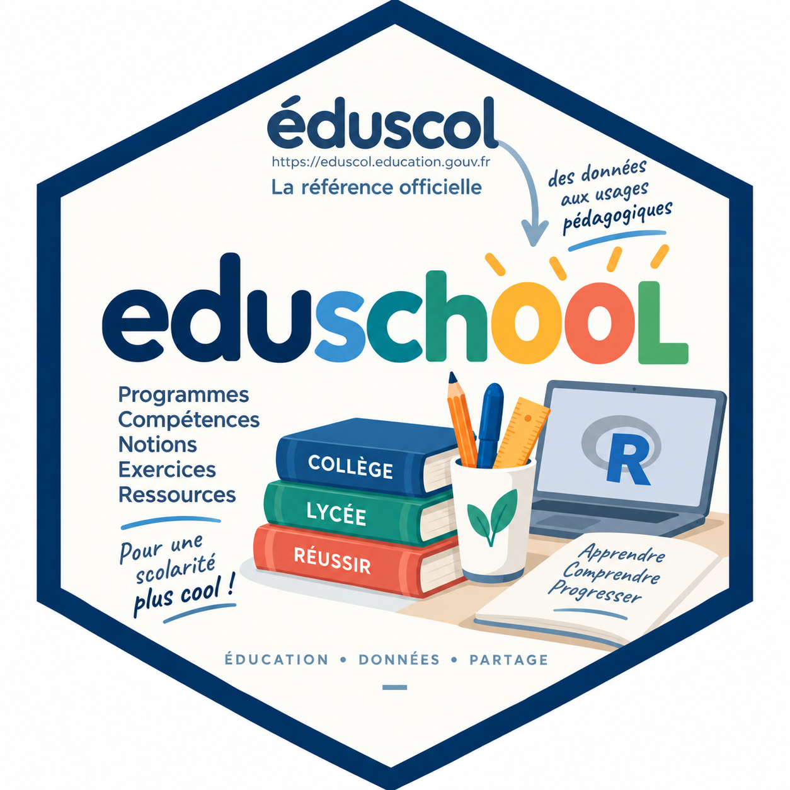

# eduschool

<p align="center">
  
</p>

`eduschool` permet de consulter simplement les programmes scolaires français,
les notions essentielles d'un niveau et de générer des exercices de révision.

## Installation

```r
install.packages("remotes")
remotes::install_github("gilles13/eduschool")
```

Puis :

```r
library(eduschool)
```

## Commencer en quelques commandes

Obtenir une vue synthétique d'une classe :

```r
genere_resume("6E")
```

Se concentrer sur une matière :

```r
genere_resume("6E", matiere = "maths")
```

Générer immédiatement quelques exercices et afficher leurs énoncés :

```r
generer_fiche(
  niveau_id = "6E",
  capacite_id = "ITM_MAT_C3_6E_C09",
  n = 3,
  difficulte = 1,
  seed = 2026,
  afficher = TRUE
)
```

L'affectation à un objet n'est utile que si l'on souhaite réutiliser ensuite les
exercices, par exemple pour produire une fiche ou un corrigé.

## Documentation

La vignette **Explorer une classe de 6e avec eduschool** constitue le point de
départ conseillé. Les autres vignettes détaillent les programmes, la
documentation pédagogique, les exercices et l'architecture des données.

```r
browseVignettes("eduschool")
```

La documentation complète est également publiée sur le site pkgdown du package.
