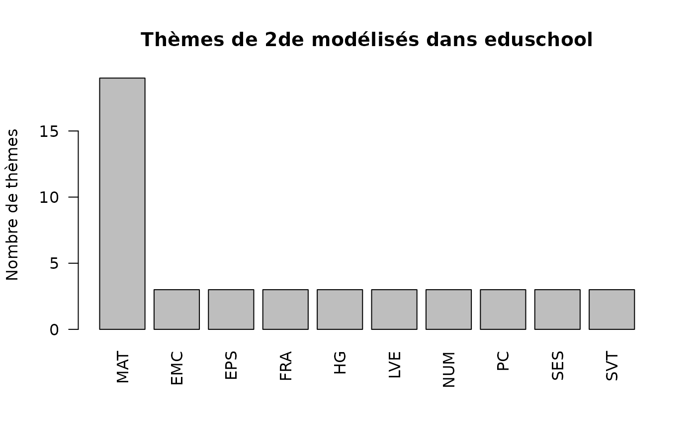

# Explorer une classe de 2de générale et technologique

Cette vignette utilise la **seconde générale et technologique** (`2GT`)
comme étude de cas lycée. L’objectif n’est pas de reproduire les textes
officiels, mais de montrer comment `eduschool` relie horaires,
programmes, notions documentées et choix d’orientation.

``` r

library(eduschool)
```

## Carte d’identité de la 2de

La seconde générale et technologique est une classe de détermination.
Dans le package,
[`genere_resume()`](https://gilles13.github.io/eduschool/reference/genere_resume.md)
donne une vue compacte des enseignements communs, des horaires et des
principaux contenus :

``` r

genere_resume("2GT") |>
  knitr::kable(row.names = FALSE)
```

| matiere | horaire | themes | notions |
|:---|:---|:---|:---|
| Français | 4 h | Lecture et interprétation ; Écriture et argumentation ; Langue et expression | Lecture et interprétation ; Écriture et argumentation ; Langue et expression |
| Histoire-géographie | 3 h | Sociétés et pouvoirs ; Territoires et mondialisation ; Environnement et mobilités | Sociétés et pouvoirs ; Territoires et mondialisation ; Environnement et mobilités |
| Langues vivantes A et B | 5 h 30 | Compréhension et réception ; Expression et interaction ; Repères culturels et interculturels | Compréhension et réception ; Expression et interaction ; Repères culturels et interculturels |
| Sciences économiques et sociales | 1 h 30 | Économie ; Sociologie ; Science politique et regards croisés | Économie ; Sociologie ; Science politique et regards croisés |
| Mathématiques – seconde générale et technologique | 4 h | Vocabulaire ensembliste et logique ; Algorithmique et programmation ; Variables et instructions élémentaires ; Notion de fonction ; Automatismes ; … |  |
| Physique-chimie | 3 h | Constitution et transformations de la matière ; Mouvement et interactions ; Ondes et signaux | Constitution et transformations de la matière ; Mouvement et interactions ; Ondes et signaux |
| Sciences de la vie et de la Terre | 1 h 30 | Terre, vie et évolution ; Enjeux contemporains de la planète ; Corps humain et santé | Terre, vie et évolution ; Enjeux contemporains de la planète ; Corps humain et santé |
| Éducation physique et sportive | 2 h | Réaliser une performance ; Adapter ses déplacements ; Conduire et maîtriser un affrontement | Réaliser une performance ; Adapter ses déplacements ; Conduire et maîtriser un affrontement |
| Enseignement moral et civique | 18 HEURE_ANNEE | Liberté ; Société ; Démocratie et citoyenneté | Liberté ; Société ; Démocratie et citoyenneté |
| Sciences numériques et technologie | 1 h 30 | Internet et Web ; Données et informatique ; Réseaux sociaux et objets connectés | Internet et Web ; Données et informatique ; Réseaux sociaux et objets connectés |

Pour obtenir les horaires sous leur forme relationnelle :

``` r

h = horaires_niveau("2GT")
h[, c("libelle", "volume", "unite")] |>
  unique() |>
  knitr::kable(row.names = FALSE)
```

| libelle                                           | volume | unite         |
|:--------------------------------------------------|:-------|:--------------|
| Français                                          | 4      | HEURE_SEMAINE |
| Histoire-géographie                               | 3      | HEURE_SEMAINE |
| Langues vivantes A et B                           | 5.5    | HEURE_SEMAINE |
| Sciences économiques et sociales                  | 1.5    | HEURE_SEMAINE |
| Mathématiques – seconde générale et technologique | 4      | HEURE_SEMAINE |
| Physique-chimie                                   | 3      | HEURE_SEMAINE |
| Sciences de la vie et de la Terre                 | 1.5    | HEURE_SEMAINE |
| Éducation physique et sportive                    | 2      | HEURE_SEMAINE |
| Enseignement moral et civique                     | 18     | HEURE_ANNEE   |
| Sciences numériques et technologie                | 1.5    | HEURE_SEMAINE |

Les données distinguent les horaires hebdomadaires des volumes annuels,
comme l’enseignement moral et civique. Sans argument `serie_id`,
[`horaires_niveau()`](https://gilles13.github.io/eduschool/reference/horaires_niveau.md)
ne retourne que la grille **commune** de la seconde générale et
technologique : la seconde spécifique STHR n’est donc pas mélangée à
cette vue.

La série STHR possède sa propre grille horaire. Elle peut être
interrogée explicitement :

``` r

h_sthr = horaires_niveau("2GT", serie_id = "STHR")
h_sthr[, c("libelle", "volume", "unite", "serie_id", "portee")] |>
  knitr::kable(row.names = FALSE)
```

| libelle | volume | unite | serie_id | portee |
|:---|:---|:---|:---|:---|
| Mathématiques – seconde générale et technologique | 3 | HEURE_SEMAINE | STHR | GRILLE_SERIE |
| Français | 4 | HEURE_SEMAINE | STHR | GRILLE_SERIE |
| Histoire-géographie | 3 | HEURE_SEMAINE | STHR | GRILLE_SERIE |
| Langues vivantes A et B | 5 | HEURE_SEMAINE | STHR | GRILLE_SERIE |
| Éducation physique et sportive | 2 | HEURE_SEMAINE | STHR | GRILLE_SERIE |
| SVT et physique-chimie | 3 | HEURE_SEMAINE | STHR | GRILLE_SERIE |
| Enseignement moral et civique | 18 | HEURE_ANNEE | STHR | GRILLE_SERIE |

Cette distinction est portée par les données elles-mêmes : `COMMUN`
désigne la grille commune au niveau, `GRILLE_SERIE` une grille complète
propre à une série et `COMPLEMENT_SERIE` un enseignement qui complète
une grille commune, comme les spécialités de la voie générale.

## Visualiser les connaissances attendues par matière

Les grands thèmes constituent un bon niveau de lecture pour comparer les
disciplines sans afficher toutes les capacités. On peut compter les
thèmes modélisés par discipline :

``` r

t2 = themes_niveau("2GT")
t2 = unique(t2[, c("programme_id", "item_id", "discipline_id", "libelle")])
couverture = sort(table(t2$discipline_id), decreasing = TRUE)
barplot(
  couverture,
  las = 2,
  ylab = "Nombre de thèmes",
  main = "Thèmes de 2de modélisés dans eduschool"
)
```



Ce graphique décrit la **granularité du référentiel `eduschool`**, pas
un poids pédagogique ou un classement des matières. Pour lire les
contenus eux-mêmes :

``` r

t2[, c("discipline_id", "libelle")] |>
  head(20) |>
  knitr::kable(row.names = FALSE)
```

| discipline_id | libelle                                              |
|:--------------|:-----------------------------------------------------|
| MAT           | Vocabulaire ensembliste et logique                   |
| MAT           | Algorithmique et programmation                       |
| MAT           | Variables et instructions élémentaires               |
| MAT           | Notion de fonction                                   |
| MAT           | Automatismes                                         |
| MAT           | Nombres et calculs, algèbre                          |
| MAT           | Arithmétique                                         |
| MAT           | Nombres réels                                        |
| MAT           | Algèbre                                              |
| MAT           | Géométrie                                            |
| MAT           | Vecteurs et problèmes de géométrie                   |
| MAT           | Droites du plan                                      |
| MAT           | Fonctions                                            |
| MAT           | Représentation algébrique et graphique des fonctions |
| MAT           | Variations et extrémums d’une fonction               |
| MAT           | Statistiques et probabilités                         |
| MAT           | Information chiffrée et statistique descriptive      |
| MAT           | Croisement de deux variables qualitatives            |
| MAT           | Probabilités                                         |
| FRA           | Lecture et interprétation                            |

Les notions documentées peuvent être interrogées séparément :

``` r

notions_niveau("2GT")[, c("discipline_id", "libelle")] |>
  head(20) |>
  knitr::kable(row.names = FALSE)
```

| discipline_id | libelle                                       |
|:--------------|:----------------------------------------------|
| FRA           | Lecture et interprétation                     |
| FRA           | Écriture et argumentation                     |
| FRA           | Langue et expression                          |
| HG            | Sociétés et pouvoirs                          |
| HG            | Territoires et mondialisation                 |
| HG            | Environnement et mobilités                    |
| EMC           | Liberté                                       |
| EMC           | Société                                       |
| EMC           | Démocratie et citoyenneté                     |
| LVE           | Compréhension et réception                    |
| LVE           | Expression et interaction                     |
| LVE           | Repères culturels et interculturels           |
| EPS           | Réaliser une performance                      |
| EPS           | Adapter ses déplacements                      |
| EPS           | Conduire et maîtriser un affrontement         |
| PC            | Constitution et transformations de la matière |
| PC            | Mouvement et interactions                     |
| PC            | Ondes et signaux                              |
| SVT           | Terre, vie et évolution                       |
| SVT           | Enjeux contemporains de la planète            |

Cette distinction est importante : les **thèmes** appartiennent à la
structure des programmes, tandis que les **notions** appartiennent à la
couche pédagogique du package. Leur niveau de détail peut donc différer.

## Focus mathématiques

Les mathématiques sont volontairement plus détaillées dans `eduschool`.
La synthèse courte s’obtient directement :

``` r

genere_resume("2GT", matiere = "maths", max_themes = 12) |>
  knitr::kable(row.names = FALSE)
```

| matiere | horaire | themes | notions |
|:---|:---|:---|:---|
| Mathématiques – seconde générale et technologique | 4 h | Vocabulaire ensembliste et logique ; Algorithmique et programmation ; Variables et instructions élémentaires ; Notion de fonction ; Automatismes ; Nombres et calculs, algèbre ; Arithmétique ; Nombres réels ; Algèbre ; Géométrie ; Vecteurs et problèmes de géométrie ; Droites du plan ; … |  |

Pour afficher l’ensemble des grands thèmes mathématiques de la seconde :

``` r

maths_2gt = themes_niveau("2GT", discipline_id = "MAT")
maths_2gt = unique(maths_2gt[, c("item_id", "libelle")])
maths_2gt |>
  knitr::kable(row.names = FALSE)
```

| item_id             | libelle                                              |
|:--------------------|:-----------------------------------------------------|
| ITM_MAT_2GT_2026_01 | Vocabulaire ensembliste et logique                   |
| ITM_MAT_2GT_2026_02 | Algorithmique et programmation                       |
| ITM_MAT_2GT_2026_03 | Variables et instructions élémentaires               |
| ITM_MAT_2GT_2026_04 | Notion de fonction                                   |
| ITM_MAT_2GT_2026_05 | Automatismes                                         |
| ITM_MAT_2GT_2026_06 | Nombres et calculs, algèbre                          |
| ITM_MAT_2GT_2026_07 | Arithmétique                                         |
| ITM_MAT_2GT_2026_08 | Nombres réels                                        |
| ITM_MAT_2GT_2026_09 | Algèbre                                              |
| ITM_MAT_2GT_2026_10 | Géométrie                                            |
| ITM_MAT_2GT_2026_11 | Vecteurs et problèmes de géométrie                   |
| ITM_MAT_2GT_2026_12 | Droites du plan                                      |
| ITM_MAT_2GT_2026_13 | Fonctions                                            |
| ITM_MAT_2GT_2026_14 | Représentation algébrique et graphique des fonctions |
| ITM_MAT_2GT_2026_15 | Variations et extrémums d’une fonction               |
| ITM_MAT_2GT_2026_16 | Statistiques et probabilités                         |
| ITM_MAT_2GT_2026_17 | Information chiffrée et statistique descriptive      |
| ITM_MAT_2GT_2026_18 | Croisement de deux variables qualitatives            |
| ITM_MAT_2GT_2026_19 | Probabilités                                         |

On retrouve notamment le vocabulaire ensembliste et logique,
l’algorithmique, les nombres et le calcul algébrique, la géométrie, les
fonctions, la statistique et les probabilités.

### Ce qu’il faut consolider avant la 2de

Pour préparer l’entrée au lycée, on peut mettre en regard les thèmes de
mathématiques de 3e et ceux de 2de, sans fabriquer une table parallèle :

``` r

maths_3e = themes_niveau("3E", discipline_id = "MAT")
maths_3e = unique(maths_3e[, c("item_id", "libelle")])
head(maths_3e, 12) |>
  knitr::kable(row.names = FALSE)
```

| item_id          | libelle                                       |
|:-----------------|:----------------------------------------------|
| ITM_MATOLD_3E_01 | Nombres et calculs                            |
| ITM_MATOLD_3E_02 | Organisation et gestion de données, fonctions |
| ITM_MATOLD_3E_03 | Grandeurs et mesures                          |
| ITM_MATOLD_3E_04 | Espace et géométrie                           |
| ITM_MATOLD_3E_05 | Algorithmique et programmation                |

Lorsque des capacités sont reliées à des notions pédagogiques,
[`notions_capacite()`](https://gilles13.github.io/eduschool/reference/notions_capacite.md)
et `prerequis_capacite(..., recursif = TRUE)` permettent d’aller plus
loin et de construire un parcours de révision ciblé.

## Après la 2de : deux grandes voies


Parcours scolaires modélisés dans eduschool

À la fin de la seconde générale et technologique, l’élève choisit
principalement entre la **voie générale** et la **voie technologique**.
En voie générale, le cycle terminal est organisé autour d’enseignements
communs et de spécialités : trois spécialités sont suivies en première,
puis deux sont conservées en terminale.

Les spécialités modélisées dans le package sont consultables directement
:

``` r

specialites = enseignements()
specialites = specialites[specialites$type == "SPECIALITE", c("enseignement_id", "libelle")]
specialites |>
  knitr::kable(row.names = FALSE)
```

| enseignement_id | libelle |
|:---|:---|
| HGGSP | Histoire-géographie, géopolitique et sciences politiques |
| HLP | Humanités, littérature et philosophie |
| LLCER | Langues, littératures et cultures étrangères et régionales |
| LLCA | Littérature et langues et cultures de l’Antiquité |
| NSI | Numérique et sciences informatiques |
| PC_SPEC | Physique-chimie – enseignement de spécialité |
| SVT_SPEC | Sciences de la vie et de la Terre – enseignement de spécialité |
| SI | Sciences de l’ingénieur |
| SES_SPEC | Sciences économiques et sociales – enseignement de spécialité |
| ARTS_SPEC | Arts – enseignement de spécialité |
| EPPCS | Éducation physique, pratiques et culture sportives |
| MATH_SPEC | Mathématiques – enseignement de spécialité |
| BIO_ECO | Biologie-écologie |

L’offre réelle dépend de l’établissement ; certaines spécialités ont
également un cadre particulier, notamment dans l’enseignement agricole.

## La voie technologique

Le référentiel
[`series()`](https://gilles13.github.io/eduschool/reference/series.md)
permet de visualiser les séries actuellement intégrées :

``` r

series()[series()$voie_id == "VOIE_TECHNOLOGIQUE", ] |>
  knitr::kable(row.names = FALSE)
```

| serie_id | libelle | voie_id |
|:---|:---|:---|
| ST2S | Sciences et technologies de la santé et du social | VOIE_TECHNOLOGIQUE |
| STL | Sciences et technologies de laboratoire | VOIE_TECHNOLOGIQUE |
| STD2A | Sciences et technologies du design et des arts appliqués | VOIE_TECHNOLOGIQUE |
| STI2D | Sciences et technologies de l’industrie et du développement durable | VOIE_TECHNOLOGIQUE |
| STMG | Sciences et technologies du management et de la gestion | VOIE_TECHNOLOGIQUE |
| STHR | Sciences et technologies de l’hôtellerie et de la restauration | VOIE_TECHNOLOGIQUE |
| S2TMD | Sciences et techniques du théâtre, de la musique et de la danse | VOIE_TECHNOLOGIQUE |

La réglementation nationale compte huit séries technologiques : ST2S,
STAV, STD2A, STI2D, STHR, STL, STMG et S2TMD. `eduschool` en modélise
actuellement sept ; **STAV** n’est pas encore intégrée, car le périmètre
actuel du package est centré sur les référentiels de l’Éducation
nationale et non sur l’enseignement agricole.

La série STHR possède en outre une seconde spécifique ; elle ne doit
donc pas être interprétée exactement comme les autres bifurcations à
partir d’une 2GT ordinaire.

## Utiliser cette vue pour le suivi scolaire

Cette vignette illustre le rôle d’`eduschool` : fournir des **vues
pratiques** construites à partir des tables relationnelles, sans devenir
une nouvelle source réglementaire. Pour un suivi individuel, on peut
partir de la synthèse de niveau, repérer les thèmes ou notions à
travailler, puis descendre vers les rappels et les exercices lorsque
ceux-ci sont disponibles.

Pour la réglementation et l’orientation, les références à privilégier
restent les sources officielles :

- [Seconde générale et technologique —
  éduscol](https://eduscol.education.fr/5466/seconde-generale-et-technologique)
  ;
- [L’orientation en seconde générale et technologique — ministère de
  l’Éducation
  nationale](https://www.education.gouv.fr/l-orientation-en-seconde-generale-et-technologique-307392)
  ;
- [La voie technologique au lycée — ministère de l’Éducation
  nationale](https://www.education.gouv.fr/reussir-au-lycee/la-voie-technologique-au-lycee-7574)
  ;
- [Après la seconde : voie générale ou technologique ? —
  Onisep](https://www.onisep.fr/formation/apres-la-2-les-poursuites-d-etudes/apres-la-seconde-choisir-la-voie-generale-ou-la-voie-technologique).
