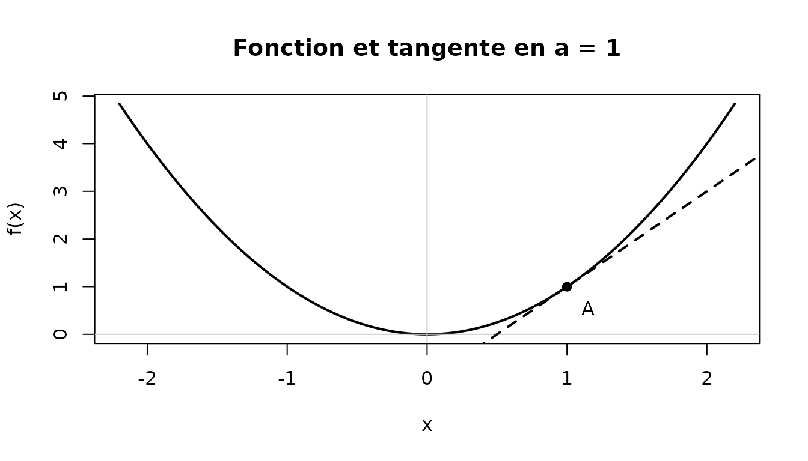

# Dérivation — Première spécialité

Cette page sert de **fiche pilote** pour la nouvelle présentation
pédagogique d’`eduschool`. Le texte courant reste sobre ; l’effet
manuscrit est réservé aux petits rappels qui doivent attirer l’œil.

## L’idée essentielle

Le **nombre dérivé** $`f'(a)`$ mesure localement la variation de la
fonction au voisinage de $`a`$. Graphiquement, il correspond au
**coefficient directeur de la tangente** à la courbe au point d’abscisse
$`a`$.


## Voir la tangente



L’équation de la tangente en $`a`$ est :

``` math
y = f(a) + f'(a)(x-a).
```

**Condition :** f dérivable en a.

## Méthode

Pour déterminer une équation de tangente :

1.  calculer $`f(a)`$ ;
2.  calculer $`f'(a)`$ ;
3.  remplacer dans $`y=f(a)+f'(a)(x-a)`$ ;
4.  vérifier que le point $`(a;f(a))`$ appartient bien à la droite
    obtenue.


## Erreur fréquente

**.** Écrire y=f’(a)x sans imposer le passage par (a,f(a)).

*Remédiation :* Vérifier systématiquement que l’équation obtenue est
satisfaite par (a,f(a)).

## Mini-exercice

Soit $`f(x)=x^2-3x+1`$.

1.  Calculer $`f'(x)`$.
2.  Calculer $`f(2)`$ et $`f'(2)`$.
3.  Déterminer une équation de la tangente à la courbe de $`f`$ au point
    d’abscisse $`2`$.


------------------------------------------------------------------------

[Retour aux mathématiques par
niveau](https://gilles13.github.io/eduschool/articles/mathematiques-par-niveau.md)

Pour tester spécifiquement le rendu PDF manuscrit depuis le dépôt :

``` r

rmarkdown::render(
  "vignettes/fiche-derivation-premiere.Rmd",
  output_format = rmarkdown::pdf_document(),
  output_file = "fiche-derivation-premiere.pdf"
)
```

La famille manuscrite peut être adaptée sans modifier le package :

``` r

options(eduschool.police_manuelle = "Ma police manuscrite")
```
