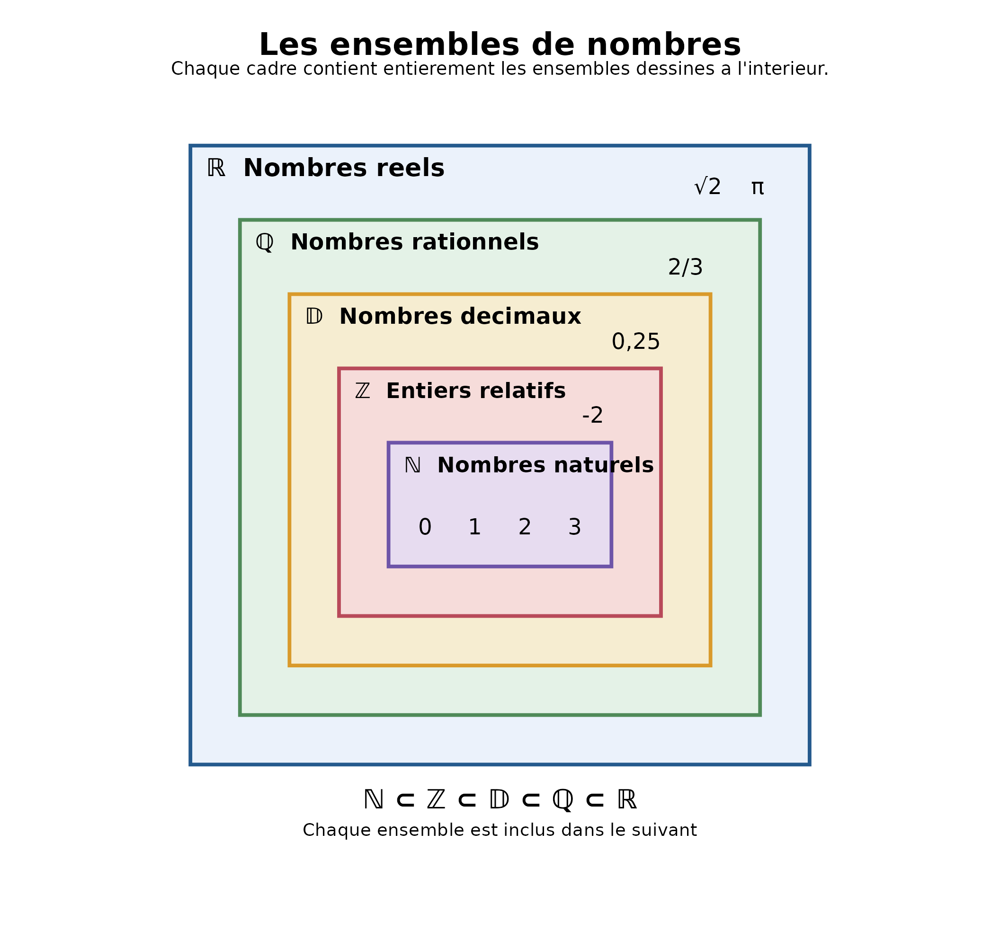

# Fiche — Les ensembles de nombres

Avant de calculer, il faut savoir **de quels nombres on parle**. Un
ensemble est simplement une collection d’objets ; ici, les objets sont
des nombres.

## Commencer par les mots

Deux definitions suffisent deja a eviter beaucoup de brouillard :

- **N – nombres naturels** : les nombres qui servent a **compter** : 0,
  1, 2, 3, … ;
- **R – nombres reels** : les nombres que l’on peut **placer sur une
  droite graduee**.

Un naturel est donc aussi un reel : par exemple, `3` appartient a N et a
R. Les deux mots ne designent pas des categories opposees : N est inclus
dans R.

> ### Surprenant
>
> **Une personne est reelle. Est-elle un reel ?**
>
> Non. Dans le langage courant, *reel* signifie « qui existe
> effectivement ». En mathematiques, un **nombre reel** est un nombre
> appartenant a R. Une personne peut donc etre **reelle** sans etre **un
> reel**.
>
> **Meme mot. Deux definitions differentes.**

## Voir l’emboitement



Le dessin montre aussi ce que chaque nouvel ensemble ajoute : `-2`
apparait dans Z mais hors de N, `0,25` dans D mais hors de Z, `2/3` dans
Q mais hors de D, et `sqrt(2)` et `pi` dans R mais hors de Q.

## La chaîne à retenir

**ℕ ⊂ ℤ ⊂ 𝔻 ⊂ ℚ ⊂ ℝ**

En allant vers la droite, les ensembles contiennent de plus en plus de
nombres. On ne perd jamais ceux que l’on avait déjà.

| Ensemble | Exemple | Ce qu’il ajoute                       |
|----------|--------:|---------------------------------------|
| ℕ        |       3 | Les nombres pour compter              |
| ℤ        |      -2 | Les entiers négatifs                  |
| 𝔻        |    0,25 | Les écritures décimales finies        |
| ℚ        |     2/3 | Les quotients de deux entiers         |
| ℝ        |   √2, π | Tous les nombres de la droite graduée |

**Exemple :** 3 appartient à ℕ, donc aussi à ℤ, 𝔻, ℚ et ℝ.

## Lire les cinq ensembles

| Symbole | Ensemble | En clair | Exemple |
|:---|:---|:---|:---|
| ℕ | Nombres naturels | Nombres qui servent à compter : 0, 1, 2, 3, … | 3 |
| ℤ | Nombres entiers | Nombres naturels, leurs opposés et zéro. | -2 |
| 𝔻 | Nombres décimaux | Nombres ayant une écriture décimale finie. | 0,25 |
| ℚ | Nombres rationnels | Nombres pouvant s’écrire comme quotient de deux entiers avec un dénominateur non nul. | 2/3 |
| ℝ | Nombres réels | Nombres que l’on peut placer sur une droite graduée. | √2 |

## Appartenir n’est pas etre inclus

Un **nombre** est un element. Un **ensemble** est une collection
d’elements.

**3 ∈ ℕ** se lit « 3 appartient à l’ensemble des naturels ».

**ℕ ⊂ ℤ** se lit « l’ensemble des naturels est inclus dans l’ensemble
des entiers ».

**A retenir : un element appartient ; un ensemble est inclus.**

## Cinq rappels, comme cinq fruits et legumes

La fiche n’est pas seulement faite pour etre lue. eduschool sait aussi
fabriquer un petit entrainement auto-corrigeable a partir de la meme
notion :

``` r

q = exercices_ensembles_nombres(seed = 2026)
produire_quiz(
  q,
  titre = "Mes 5 rappels sur les ensembles"
)
```

La premiere question part volontairement du mot *reel* et de son sens
courant. Les suivantes reviennent sur le classement d’un nombre dans le
plus petit ensemble usuel et sur la difference entre `∈` et `⊂`. Chaque
mauvaise reponse est accompagnee d’une explication : un distracteur
utile doit montrer une confusion interessante, pas seulement etre faux.

## Ouvrir la porte suivante

Une fois ces ensembles reperes, la suite naturelle consiste a apprendre
a manipuler les **intervalles**, puis l’**union** et l’**intersection**.

[Retour aux mathématiques de
2de](https://gilles13.github.io/eduschool/articles/mathematiques-2de.md)
· [Tous les
niveaux](https://gilles13.github.io/eduschool/articles/mathematiques-par-niveau.md)
