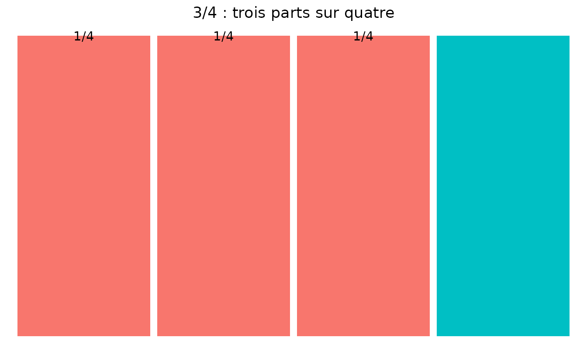
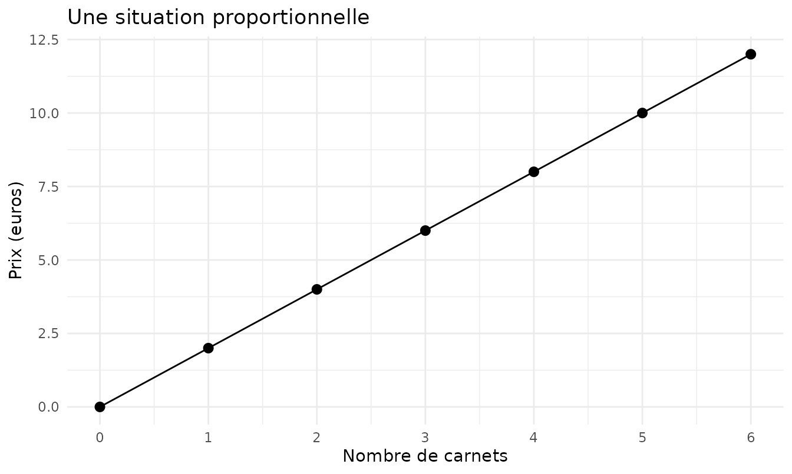
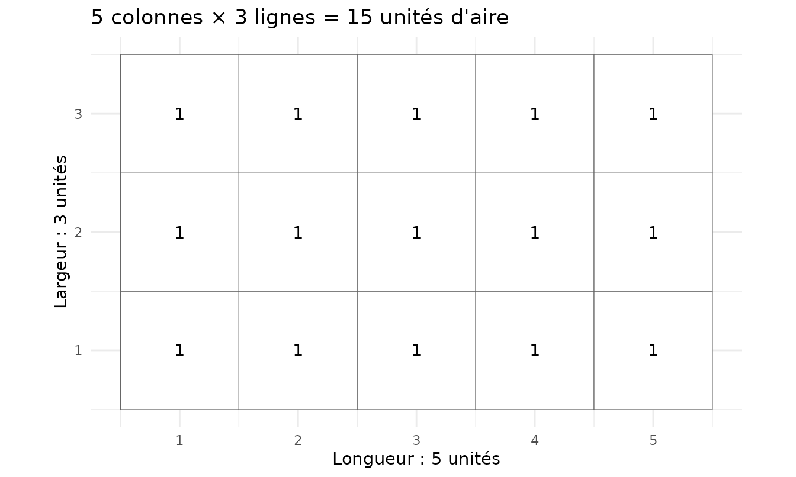
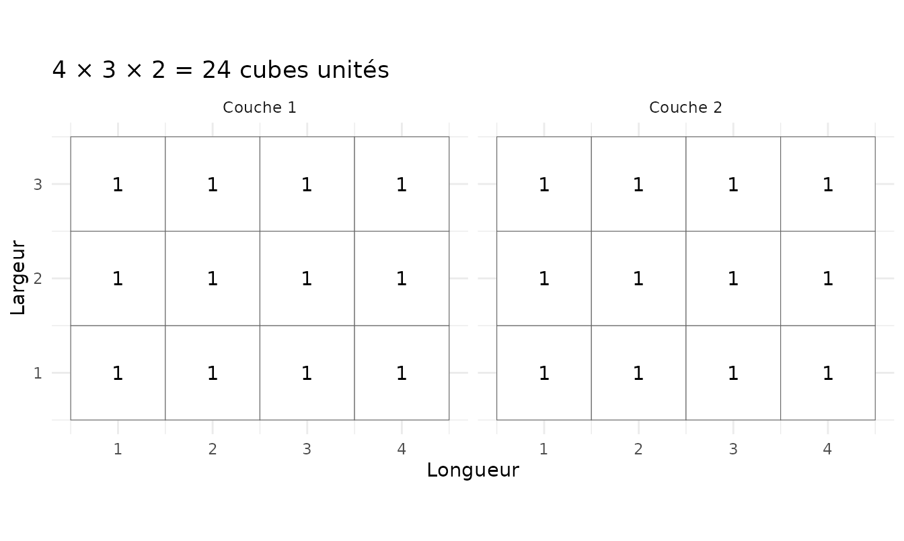
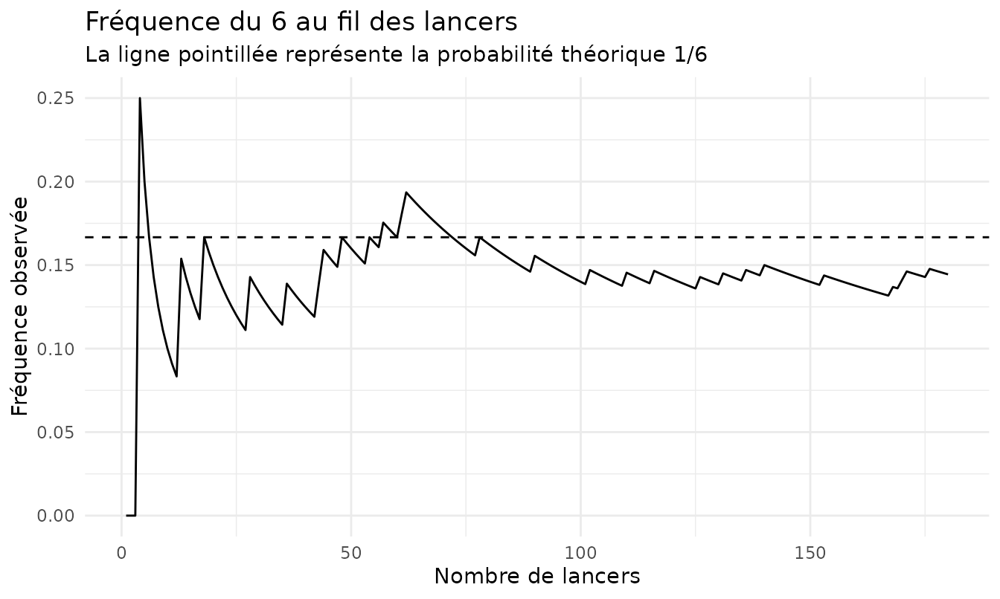

# Mathématiques 6e - Fiche essentielle


Cycle 3  ·  Sixième

Mathématiques

Fiche essentielle

L’essentiel des mathématiques en 6e


Cette fiche rassemble les **repères essentiels de mathématiques de 6e**.
Elle ne cherche pas à remplacer le cours : elle sert à retrouver
rapidement les notions, formules et réflexes à maîtriser, puis à
**voir** quelques idées qui deviennent plus simples lorsqu’elles sont
représentées.

Le contenu est aligné sur le [programme officiel de mathématiques du
cycle 3](https://www.education.gouv.fr/bo/2025/Hebdo16/MENE2504620A), en
vigueur en 6e depuis la rentrée 2025-2026.

## Les repères essentiels

### Nombres et calcul

Savoir lire écrire comparer et ordonner des nombres entiers ou décimaux.
Estimer l’ordre de grandeur d’un résultat et respecter les priorités de
calcul.

### Repérage et solides

Savoir lire les coordonnées d’un point se repérer sur un plan
reconnaître cube et pavé droit et relier un solide à certaines de ses
représentations planes.

### Réflexes

Avant de calculer identifier les données utiles choisir l’opération et
vérifier l’unité. Après le calcul contrôler le signe l’ordre de grandeur
et la cohérence de la réponse.

### Fractions et pourcentages

Une fraction représente un quotient. Un pourcentage est une fraction sur
100.

\frac{a}{b}=a\div b \quad t\\=\frac{t}{100}

### Proportionnalité

Dans une situation proportionnelle on peut multiplier les deux grandeurs
par le même nombre ou revenir à l’unité. Toujours écrire les unités dans
le tableau.

### Périmètres

Le périmètre est la longueur du contour. Pour un disque utiliser le
diamètre d ou le rayon r.

P\_{rectangle}=2(L+l) \quad P\_{carre}=4c \quad P\_{disque}=\pi d=2\pi r

### Aires

L’aire mesure une surface. Les unités d’aire sont au carré.

A\_{rectangle}=L\times l \quad A\_{carre}=c^2

### Géométrie

Dans un triangle la somme des angles vaut 180 degrés. La médiatrice d’un
segment est perpendiculaire au segment et passe par son milieu. Un point
de la médiatrice est à égale distance des deux extrémités.

### Volumes et durées

Un volume peut se mesurer en cubes unités comme le cm³. Pour un pavé
droit on multiplie longueur largeur et hauteur. Pour un cube les trois
dimensions sont égales. Repères utiles : 1 dm³ = 1 L et 1 cm³ = 1 mL.
Pour les durées : 1 h = 60 min et 1 min = 60 s.

V\_{pave}=L\times l\times h \quad V\_{cube}=c^3

### Données et probabilités

Savoir lire et produire un tableau ou un graphique. Une probabilité est
comprise entre 0 et 1. En équiprobabilité elle compare les cas
favorables aux cas possibles. Une fréquence observée sur de nombreuses
répétitions peut aider à estimer une probabilité.

P(A)=\frac{nombre\\ de\\ cas\\ favorables}{nombre\\ de\\ cas\\
possibles}

### Algèbre et pensée informatique

Une lettre peut représenter un nombre inconnu ou variable. Savoir
compléter une égalité simple repérer une régularité et exécuter une
suite d’instructions. Une boucle permet de répéter plusieurs fois les
mêmes instructions.

## Voir pour comprendre

Les graphiques suivants ne sont pas là pour décorer la fiche. Ils
montrent pourquoi certaines règles fonctionnent. Une formule est plus
facile à retenir lorsqu’elle a d’abord eu une raison d’exister.

### Une fraction représente une part d’un tout

Pour visualiser \frac{3}{4}, on partage une unité en quatre parts égales
et on en retient trois.



**À retenir :** le dénominateur indique en combien de parts égales
l’unité est partagée ; le numérateur indique combien de parts sont
considérées.

### La proportionnalité conserve le même rapport

Si 1 carnet coûte 2 euros, alors 2 carnets coûtent 4 euros, 3 en coûtent
6, etc. Les points sont alignés avec l’origine : le prix est toujours
obtenu en multipliant la quantité par 2.



**Piège classique :** une situation qui augmente n’est pas forcément
proportionnelle. Il faut conserver le même rapport entre les deux
grandeurs.

### L’aire d’un rectangle compte des carrés unités

Un rectangle de 5 unités sur 3 contient 5 carrés sur chaque ligne et 3
lignes : 5 \times 3 = 15 carrés unités.



C’est ce dénombrement qui conduit à :

A\_{rectangle}=L\times l

### Le volume compte des cubes unités

Prenons un pavé droit de longueur 4, largeur 3 et hauteur 2. Chaque
couche contient 4\times3=12 cubes. Deux couches donnent donc 24 cubes
unités.



On généralise alors :

V\_{pavé}=L\times l\times h

Pour un cube de côté c, les trois dimensions sont égales :

V\_{cube}=c^3

**Repères utiles :** 1\\dm^3=1\\L et 1\\cm^3=1\\mL.

### Une fréquence expérimentale peut se stabiliser

Une probabilité théorique décrit ce que l’on attend. Une fréquence
décrit ce que l’on observe. Lorsqu’on répète beaucoup une expérience
aléatoire, la fréquence peut se rapprocher de la probabilité théorique.



**À retenir :** sur peu d’essais, la fréquence peut beaucoup varier.
Répéter l’expérience permet d’observer sa stabilisation progressive.

## Les réflexes à garder

- Écrire les unités et vérifier qu’elles sont cohérentes.
- Estimer l’ordre de grandeur avant ou après un calcul.
- Pour une aire, penser en **carrés unités** ; pour un volume, en
  **cubes unités**.
- Pour une fraction, identifier le tout avant de compter les parts.
- En proportionnalité, vérifier que le même multiplicateur relie les
  valeurs.
- En géométrie, faire une figure aide à raisonner mais ne remplace pas
  une propriété.
- En probabilités, distinguer la probabilité théorique de la fréquence
  observée.

> Une formule n’est pas une incantation. Si elle semble tomber du ciel,
> le dessin juste au-dessus mérite probablement un deuxième regard.

------------------------------------------------------------------------

[Retour à l’index des fiches de
mathématiques](https://gilles13.github.io/eduschool/articles/fiches-revision-mathematiques.md)

Pour produire cette fiche depuis R :

``` r

revision = generer_essentiel("6E")
produire_revision(revision, "revision_6e", format = "pdf")
```
