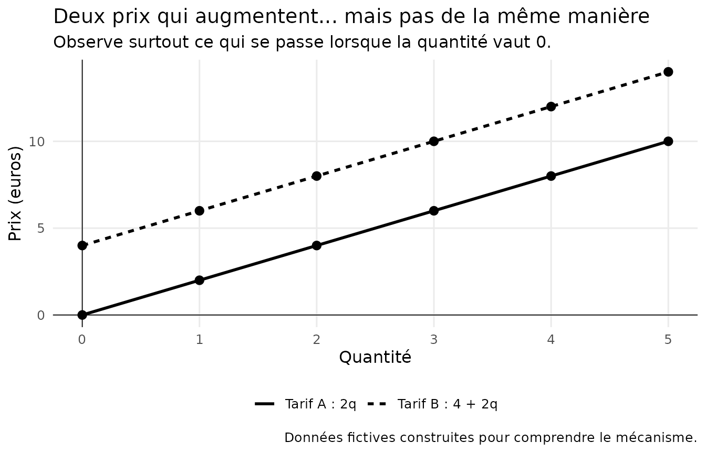
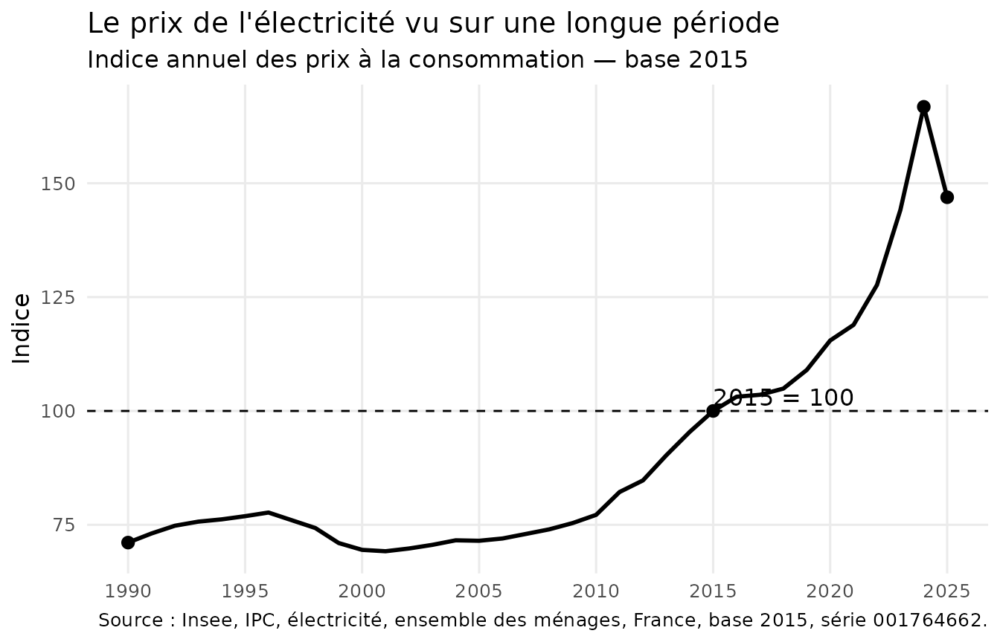

# Maths & économie — Un prix est-il toujours proportionnel à ce qu'on achète ?

## Un prix est-il toujours proportionnel à ce qu’on achète ?

On achète des pommes à **2 euros le kilogramme**.

Un kilogramme coûte 2 euros, deux kilogrammes coûtent 4 euros, trois
kilogrammes coûtent 6 euros…

Autrement dit :

P = 2q

où q représente la quantité achetée et P le prix payé.

Si on achète deux fois plus, on paie deux fois plus.

Cela ressemble beaucoup à une situation de **proportionnalité**.

Mais est-ce ainsi que fonctionnent tous les prix ?

## Je regarde

Comparons deux tarifs très simples.

- **Tarif A** : 2 euros par unité.
- **Tarif B** : 4 euros de coût fixe, puis 2 euros par unité.

Les deux prix augmentent de **2 euros** chaque fois que l’on ajoute une
unité.

Pourtant, une seule des deux situations est proportionnelle.

**Laquelle ?**

## Je comprends

Pour le tarif A :

1 \longrightarrow 2

2 \longrightarrow 4

3 \longrightarrow 6

On passe toujours de la quantité au prix en multipliant par le **même
nombre** :

P = 2q

Le coefficient de proportionnalité vaut donc 2.

Et surtout :

q=0 \quad\Longrightarrow\quad P=0

Sur le graphique, la droite passe par l’origine.

C’est une propriété importante :

> **Lorsqu’une situation de proportionnalité est représentée par une
> droite, cette droite passe par l’origine.**

Regardons maintenant le tarif B :

P = 4 + 2q

Pour une quantité nulle :

q=0 \quad\Longrightarrow\quad P=4

Il faut déjà payer 4 euros avant même de consommer la première unité.

La droite ne passe donc pas par l’origine.

> **Deux grandeurs peuvent évoluer ensemble sans être
> proportionnelles.**

## Attention, piège !

Regardons seulement ces valeurs :

| Quantité |     Prix |
|---------:|---------:|
|        1 |  6 euros |
|        2 |  8 euros |
|        3 | 10 euros |
|        4 | 12 euros |

Le prix augmente toujours de 2 euros.

On pourrait donc être tenté de penser :

> « Puisqu’on ajoute toujours la même chose, c’est proportionnel. »

**Tu t’es fait avoir !**

Dans une situation de proportionnalité, ce n’est pas une même quantité
que l’on **ajoute**.

C’est un même nombre par lequel on **multiplie**.

Ici :

6/1=6

mais :

8/2=4

Le rapport n’est pas constant.

Il n’y a donc pas de coefficient de proportionnalité.

## Et le produit en croix ?

Revenons au tarif A.

Trois unités coûtent 6 euros.

Combien coûtent 7 unités ?

Puisque nous savons que le prix est proportionnel à la quantité :

\frac{6}{3}=\frac{x}{7}

Le coefficient de proportionnalité vaut :

6/3=2

Donc :

x=7\times2=14

On peut également écrire :

3x=6\times7

puis :

x=14

C’est le fameux **produit en croix**.

Mais attention :

> **Le produit en croix ne permet pas de décider qu’une situation est
> proportionnelle. Il permet de calculer une valeur lorsqu’on sait déjà
> qu’elle l’est.**

Ce n’est donc pas une formule magique.

Il fonctionne parce qu’il repose sur une relation de proportionnalité.

## Maintenant, regardons le monde réel

Dans la vraie vie, les prix ne suivent pas toujours une règle aussi
simple que :

P=kq

Un tarif peut comprendre :

- une partie fixe ;
- une partie dépendant de la consommation ;
- plusieurs niveaux de tarification ;
- des taxes ;
- des réductions ;
- des règles qui changent dans le temps.

L’électricité constitue un bon exemple.

Une facture d’électricité ne se résume pas à :

\text{consommation}\times\text{prix}

Elle peut notamment comporter une partie fixe et une partie liée à la
quantité d’électricité consommée.

Notre modèle :

P=4+2q

ne décrit évidemment pas une véritable facture d’électricité.

Il nous aide simplement à comprendre une idée.

> **Un modèle mathématique simplifie volontairement le réel. Comprendre
> le modèle ne signifie pas que le réel fonctionne exactement comme
> lui.**

## Les données racontent une histoire

L’Insee publie un indice annuel des prix à la consommation consacré à
l’électricité.

La série historique en base 2015 permet d’observer l’évolution de cet
indice de **1990 à 2025**.

Pour cette première exploration, nous utilisons uniquement deux
variables :

- l’année ;
- la valeur de l’indice.

## Que voyons-nous ?

La courbe ne monte pas régulièrement.

Certaines périodes sont relativement stables.

D’autres connaissent des évolutions beaucoup plus rapides.

Entre 2015 et 2024, par exemple, l’indice passe de :

100

à environ :

166{,}8

Cela ne signifie pas qu’une facture précise est passée de 100 euros à
166,8 euros.

L’indice sert à mesurer une **évolution des prix**.

C’est une distinction essentielle :

> **Un indice de prix n’est pas un prix.**

Et déjà une nouvelle question apparaît :

> Comment mesure-t-on exactement cette évolution ?

## Une vérité peut en cacher une autre

Regardons seulement les deux dernières valeurs de notre série :

2024 : 166{,}78

2025 : 146{,}92

L’indice diminue fortement.

On pourrait donc dire :

> « Le prix de l’électricité a baissé en 2025. »

C’est bien ce que montre cette comparaison.

Mais regardons maintenant la série depuis 1990.

La conclusion devient plus riche.

Le niveau de 2025 reste très supérieur à celui observé pendant une
grande partie de la période.

Les deux observations ne se contredisent pas :

- le prix peut **baisser sur une période courte** ;
- tout en restant **beaucoup plus élevé que plusieurs années
  auparavant**.

> **La période choisie fait partie de la question que l’on pose aux
> données.**

Une vérité peut donc en cacher une autre.

## Attention : une courbe peut aussi nous tendre un piège

En 2026, l’Insee a changé la base de calcul de l’indice des prix à la
consommation.

La série précédente utilisait :

2015=100

La nouvelle utilise :

2025=100

Supposons que l’on colle naïvement les deux séries l’une derrière
l’autre sans regarder leur définition.

On pourrait voir apparaître une rupture spectaculaire.

Et penser :

> « Ouh là ! Que s’est-il passé ? »

Crise ?

Effondrement des prix ?

Événement économique majeur ?

Pas nécessairement.

**Tu t’es fait avoir.**

On a simplement changé de base.

Le nombre utilisé pour représenter le niveau de l’indice a changé.

Avant d’interpréter une rupture dans un graphique, il faut donc vérifier
:

- la source ;
- l’unité ;
- la base ;
- le champ étudié ;
- la définition ;
- la méthode ;
- l’existence éventuelle d’une rupture de série.

> **Avant d’expliquer une forme étrange dans un graphique par le monde
> réel, vérifie qu’elle ne vient pas de la manière dont les données ont
> été construites.**

## Ce que les données permettent de dire

Les données nous permettent d’étudier l’évolution de l’indice des prix
de l’électricité dans le temps.

Elles permettent notamment :

- de comparer des périodes ;
- de calculer des variations ;
- d’observer des accélérations ou des ralentissements ;
- de replacer une évolution récente dans une histoire plus longue.

## Ce qu’elles ne permettent pas de dire toutes seules

Le graphique ne nous explique pas **pourquoi** les prix ont évolué.

Il ne permet pas non plus de connaître directement la facture d’un
ménage particulier.

Pour comprendre les causes, il faudrait mobiliser d’autres informations
:

- structure des tarifs ;
- consommation ;
- fiscalité ;
- coûts de production ;
- marchés de l’énergie ;
- décisions publiques ;
- contexte économique.

> **Une donnée ne dit pas davantage que ce qu’elle mesure.**

## Les maths nous ont amenés jusqu’ici

Nous étions partis d’une question très simple :

> Un prix est-il toujours proportionnel à ce qu’on achète ?

Pour y répondre, nous avons rencontré :

- la proportionnalité ;
- le coefficient de proportionnalité ;
- la représentation graphique ;
- le produit en croix ;
- une relation comportant une partie fixe ;
- un indice ;
- une série temporelle ;
- une variation ;
- le choix d’une période ;
- le changement de base ;
- la lecture critique d’un graphique.

Et maintenant de nouvelles questions apparaissent.

Comment calcule-t-on une variation en pourcentage ?

Pourquoi une baisse de 10 % n’annule-t-elle pas nécessairement une
hausse de 10 % ?

Comment construit-on un indice ?

Pourquoi choisit-on une base 100 ?

Comment comparer des prix séparés de trente ans ?

Comment mesure-t-on l’inflation ?

### Une porte s’ouvre…

Nous venons de découvrir qu’une grandeur peut dépendre d’une autre sans
lui être proportionnelle.

En mathématiques, il existe un outil beaucoup plus général pour décrire
ce type de relation :

**les fonctions**.

Tu n’as pas besoin de les connaître pour avoir compris cette fiche.

Mais un jour, si tu pousses cette porte, tu retrouveras peut-être nos
deux tarifs :

P(q)=2q

et

P(q)=4+2q

Ils auront alors beaucoup d’autres choses à raconter.

## Sources

**Insee — Indice des prix à la consommation**

Série 001764662 : indice annuel des prix à la consommation, base 2015,
ensemble des ménages, France, électricité. Série 1990–2025, arrêtée lors
du passage à la base 2025.

**Insee — IPC base 2025**

À partir de 2026, l’indice des prix à la consommation est publié en base
2025. La série « Électricité » correspond notamment à l’identifiant
011815810.

**Commission de régulation de l’énergie**

Historique des tarifs réglementés de vente d’électricité pour les
consommateurs résidentiels, réseau Enedis, options Base et heures
pleines/heures creuses, depuis 2012.

------------------------------------------------------------------------

> **Un graphique eduschool ne doit pas seulement montrer un résultat. Il
> doit aider à voir le raisonnement.**

Et surtout :

> **Un savoir compris ouvre une nouvelle question. Et une nouvelle
> question donne envie d’apprendre encore.**

**∞**
