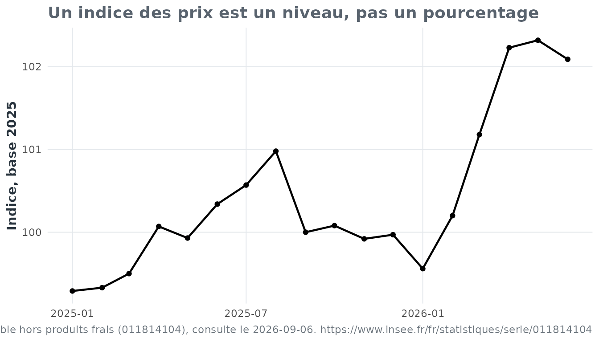

# Mathématiques et économie : tous les problèmes sont relatifs

## Pourquoi faire ça ?

**Vous trouviez les pourcentages déprimants ? Attendez de les appliquer
à l’inflation.**

L’objectif n’est pas de transformer `eduschool` en package d’analyse
economique. L’economie fournit ici un contexte reel ; les mathematiques
restent l’objet d’apprentissage.

> **Les mathématiques nous apprennent que tous les problèmes sont
> relatifs. L’économie fournit les données permettant de le vérifier.**

## Un petit jeu réel, figé et reproductible

La vignette ne télécharge rien. Elle utilise un extrait minuscule d’une
série Insee embarqué avec le package :

``` r

ipc = ipc_exemple()
head(ipc)
#>         date indice
#> 1 2025-01-01  99.29
#> 2 2025-02-01  99.33
#> 3 2025-03-01  99.50
#> 4 2025-04-01 100.07
#> 5 2025-05-01  99.93
#> 6 2025-06-01 100.34
```

``` r

citer_source(ipc)
#> [1] "Source : Insee - Indice des prix a la consommation - Base 2025 - Ensemble des menages - France - Ensemble hors produits frais (011814104), consulte le 2026-09-06. https://www.insee.fr/fr/statistiques/serie/011814104"
```

Le snapshot sert aux tests et aux exemples. Pour une analyse courante,
les données doivent être récupérées depuis leur producteur officiel.

> **Le réseau sert à actualiser les données. Il ne sert jamais à prouver
> que le package fonctionne.**

## De l’indice au pourcentage

Un indice base 100 n’est pas lui-même un taux d’inflation. La variation
entre deux indices se calcule par :

\frac{V_f - V_i}{V_i} \times 100

ou, de manière équivalente :

\left(\frac{V_f}{V_i} - 1\right) \times 100.

Par exemple :

``` r

variation_pourcentage(99.29, 99.56)
#> [1] 0.2719307
```

`99.56` est donc un **indice**, pas une hausse de `99.56 %`.

``` r

ipc = ajouter_variations_ipc(ipc)
tail(ipc)
#>          date indice variation_mensuelle_pct variation_annuelle_pct
#> 13 2026-01-01  99.56             -0.41012304              0.2719307
#> 14 2026-02-01 100.20              0.64282845              0.8758683
#> 15 2026-03-01 101.18              0.97804391              1.6884422
#> 16 2026-04-01 102.23              1.03775450              2.1584891
#> 17 2026-05-01 102.32              0.08803678              2.3916742
#> 18 2026-06-01 102.09             -0.22478499              1.7440702
```

## Regarder avant de conclure

``` r

ggplot2::ggplot(ipc, ggplot2::aes(x = date, y = indice)) +
  ggplot2::geom_line(linewidth = 0.8) +
  ggplot2::geom_point(size = 1.5) +
  ggplot2::labs(
    title = "Un indice des prix est un niveau, pas un pourcentage",
    x = NULL,
    y = "Indice, base 2025",
    caption = citer_source(ipc)
  ) +
  theme_eduschool()
```



### Avertissement pédagogique

L’utilisation de données économiques réelles peut provoquer une
compréhension soudaine de l’actualité.

`eduschool` décline toute responsabilité concernant les conséquences sur
le moral du lecteur.

Bonne nouvelle : les mathématiques permettent de comprendre ce qui se
passe.

Mauvaise nouvelle : elles permettent de comprendre ce qui se passe.
