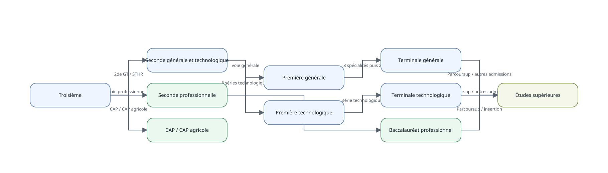
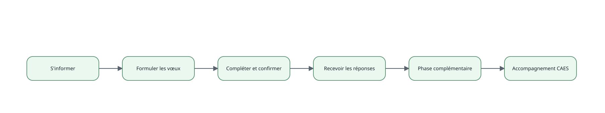
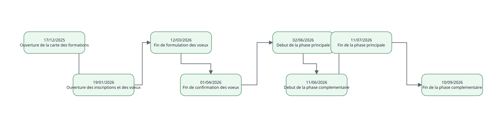

# S'orienter au lycée et après le bac

L’orientation scolaire n’est pas une décision unique prise au moment du
baccalauréat. Elle se construit par **bifurcations successives** : choix
d’une voie après la 3e, choix entre voie générale et séries
technologiques après la 2de générale et technologique, choix des
spécialités en voie générale, puis choix d’une formation supérieure.

Cette vignette est produite à partir des tables relationnelles
d’`eduschool`. Les schémas ci-dessous ne sont donc pas dessinés
manuellement dans le document.

## Vue d’ensemble du parcours

Le schéma représente les principales voies. Il ne prétend pas
représenter tous les cas particuliers, passerelles ou formations
relevant d’autres ministères.

## Première étape : après la 3e

À la fin de la 3e, les principales voies d’orientation sont la **2de
générale et technologique** (ou la 2de à régime spécifique STHR), la
**2de professionnelle** et la première année de **CAP ou CAP agricole**.
Le choix de voie et l’affectation dans un établissement sont deux
opérations distinctes.

| Orientation          | Identifiant de destination |
|:---------------------|:---------------------------|
| 2de GT / STHR        | 2GT                        |
| voie professionnelle | 2PRO                       |
| CAP / CAP agricole   | CAP                        |

## Deuxième étape : après la 2de générale et technologique

Après la 2de GT, l’élève peut notamment poursuivre en **1re générale**
ou dans l’une des **huit séries technologiques**. La série STAV relève
de l’enseignement agricole ; elle est néanmoins conservée dans le
référentiel afin de présenter le système d’orientation dans son
ensemble.

| Série | Libellé                                                             |
|:------|:--------------------------------------------------------------------|
| ST2S  | Sciences et technologies de la santé et du social                   |
| STL   | Sciences et technologies de laboratoire                             |
| STD2A | Sciences et technologies du design et des arts appliqués            |
| STI2D | Sciences et technologies de l’industrie et du développement durable |
| STMG  | Sciences et technologies du management et de la gestion             |
| STHR  | Sciences et technologies de l’hôtellerie et de la restauration      |
| S2TMD | Sciences et techniques du théâtre, de la musique et de la danse     |
| STAV  | Sciences et technologies de l’agronomie et du vivant                |

## Spécialités et options : deux rôles différents

En voie générale, le choix structurant porte sur les **enseignements de
spécialité** : trois sont suivis en 1re, puis deux sont conservés en
Terminale. Les enseignements optionnels enrichissent le parcours mais ne
doivent pas être confondus avec les spécialités.

| Spécialité | Libellé                                                        |
|:-----------|:---------------------------------------------------------------|
| HGGSP      | Histoire-géographie, géopolitique et sciences politiques       |
| HLP        | Humanités, littérature et philosophie                          |
| LLCER      | Langues, littératures et cultures étrangères et régionales     |
| LLCA       | Littérature et langues et cultures de l’Antiquité              |
| NSI        | Numérique et sciences informatiques                            |
| PC_SPEC    | Physique-chimie – enseignement de spécialité                   |
| SVT_SPEC   | Sciences de la vie et de la Terre – enseignement de spécialité |
| SI         | Sciences de l’ingénieur                                        |
| SES_SPEC   | Sciences économiques et sociales – enseignement de spécialité  |
| ARTS_SPEC  | Arts – enseignement de spécialité                              |
| EPPCS      | Éducation physique, pratiques et culture sportives             |
| MATH_SPEC  | Mathématiques – enseignement de spécialité                     |
| BIO_ECO    | Biologie-écologie                                              |

Les options modélisées pour la Terminale générale 2026-2027 comprennent
par exemple les mathématiques expertes ou complémentaires :

| niveau_id | enseignement_id | libelle | volume | unite |
|:---|:---|:---|:---|:---|
| TG | LVC | Langue vivante C | 3 | HEURE_SEMAINE |
| TG | LCA_LATIN | Langues et cultures de l’Antiquité – latin | 3 | HEURE_SEMAINE |
| TG | LCA_GREC | Langues et cultures de l’Antiquité – grec | 3 | HEURE_SEMAINE |
| TG | EPS_OPT | Éducation physique et sportive – option | 3 | HEURE_SEMAINE |
| TG | ARTS_OPT | Arts – option | 3 | HEURE_SEMAINE |
| TG | LSF | Langue des signes française | 3 | HEURE_SEMAINE |
| TG | MATH_COMPLEMENTAIRES | Mathématiques complémentaires | 3 | HEURE_SEMAINE |
| TG | MATH_EXPERTES | Mathématiques expertes | 3 | HEURE_SEMAINE |
| TG | DROIT_GEMC | Droit et grands enjeux du monde contemporain | 3 | HEURE_SEMAINE |

Cette séparation est importante : une option peut compléter un projet,
tandis que les spécialités structurent beaucoup plus directement le
parcours de la voie générale et la préparation aux études supérieures.

## Après le bac : plusieurs familles de formations

Les études supérieures ne se réduisent pas à l’université. Les grandes
familles modélisées ici couvrent notamment licences, BUT, BTS, CPGE,
écoles et formations spécialisées.

| Formation | Cadre | Durée min. | Durée max. | Admission | Diplôme principal |
|:---|:---|:---|:---|:---|:---|
| Brevet de technicien supérieur | LYCEE | 2 | 2 | SELECTIVE | BTS |
| Classe préparatoire aux grandes écoles | LYCEE | 2 | 2 | SELECTIVE |  |
| Arts, design et création | ECOLE | 3 | 5 | SELECTIVE | DN MADE ou diplôme d’école |
| Bachelor universitaire de technologie | UNIVERSITE | 3 | 3 | SELECTIVE | BUT |
| Écoles de commerce et de management | ECOLE | 3 | 5 | SELECTIVE | Diplôme d’école |
| Études de santé | UNIVERSITE | 3 | 10 | SELECTIVE | Diplômes de santé |
| Formations sociales et paramédicales | ECOLE | 3 | 5 | SELECTIVE | Diplôme d’État |
| Licence | UNIVERSITE | 3 | 3 | NON_SELECTIVE | Licence |
| Écoles d’ingénieurs | ECOLE | 5 | 5 | SELECTIVE | Diplôme d’ingénieur |

La durée indicative fournit une autre lecture de ces parcours :

Ces durées sont des repères de structure, pas des garanties de durée
réelle du parcours d’un étudiant.

## Parcoursup : à quoi sert la plateforme ?

Parcoursup est la plateforme nationale de préinscription en première
année de l’enseignement supérieur. La procédure distingue l’information
sur les formations, la formulation des vœux, la finalisation du dossier,
la phase d’admission et, si nécessaire, la phase complémentaire ou
l’accompagnement par la CAES.

| libelle | description |
|:---|:---|
| S’informer | Découvrir les formations, leurs attendus, critères d’examen, coûts, débouchés et données d’accès. |
| Formuler les vœux | Créer son dossier et formuler jusqu’à 10 vœux hors apprentissage, sans les classer par préférence. |
| Compléter et confirmer | Compléter les pièces demandées et confirmer chacun des vœux formulés. |
| Recevoir les réponses | Consulter les réponses des formations et les propositions d’admission au fil de la phase principale. |
| Phase complémentaire | Formuler de nouveaux vœux dans les formations disposant encore de places. |
| Accompagnement CAES | En l’absence de proposition, solliciter l’accompagnement de la commission d’accès à l’enseignement supérieur. |

### La campagne 2026 : une frise, pas un schéma figé

Les dates changent d’une année à l’autre. Elles ne sont donc **pas des
colonnes du modèle Parcoursup** : chaque date importante est un
événement rattaché à une campagne et, lorsque c’est pertinent, à une
étape structurelle. Une campagne future peut ainsi ajouter ou retirer un
jalon sans modifier le schéma des tables.

La même information reste naturellement interrogeable sous forme
tabulaire :

| Date | Jalon | Description |
|:---|:---|:---|
| 17/12/2025 | Ouverture de la carte des formations | Consultation de l offre de formations 2026 et des fiches de presentation. |
| 19/01/2026 | Ouverture des inscriptions et des voeux | Creation du dossier candidat et debut de la formulation des voeux. |
| 12/03/2026 | Fin de formulation des voeux | Dernier jour national pour formuler les voeux hors cas particuliers et apprentissage. |
| 01/04/2026 | Fin de confirmation des voeux | Dernier jour pour completer le dossier et confirmer chacun des voeux. |
| 02/06/2026 | Debut de la phase principale | Les candidats commencent a recevoir les reponses des formations. |
| 11/06/2026 | Debut de la phase complementaire | De nouveaux voeux peuvent etre formules dans les formations disposant encore de places. |
| 11/07/2026 | Fin de la phase principale | Cloture de la phase principale d admission 2026. |
| 10/09/2026 | Fin de la phase complementaire | Cloture de la phase complementaire 2026. |

Cette frise présente le calendrier national de référence. Des
adaptations territoriales ou des règles particulières peuvent exister ;
elles pourront être ajoutées ultérieurement comme données de périmètre
sans modifier la structure.

Pour 2026, plusieurs enrichissements des fiches formation sont mis en
avant : meilleure visibilité sur les profils des admis des années
précédentes et nouvelles données sur la réussite et l’insertion.

| libelle | description |
|:---|:---|
| Profils des admis enrichis | Les fiches formation affichent davantage d informations sur le profil des candidats admis les annees precedentes, notamment serie de bac, niveau scolaire et parcours au lycee. |
| Reussite et insertion mieux documentees | Les fiches formation donnent de nouvelles donnees sur la reussite et l insertion afin d eclairer les choix. |

## Avant Parcoursup : APB

**Admission Post-Bac (APB)** a précédé Parcoursup. La plateforme,
généralisée au niveau national avant 2010, a été utilisée jusqu’à la
campagne 2017 et remplacée par Parcoursup en 2018. L’objectif ici n’est
pas de reconstituer toute l’histoire d’APB, mais de conserver ce repère
pour comprendre le changement de système.

| libelle | APB | PARCOURSUP |
|:---|:---|:---|
| Expression des préférences | Vœux classés par ordre de préférence | Vœux non classés lors de leur formulation |
| Logique de proposition | Affectation centralisée prenant en compte l’ordre des vœux | Classement des candidatures par les formations puis propositions transmises progressivement par la plateforme |
| Période de référence | Dernière campagne nationale en 2017 | Première campagne en 2018 |

Une différence immédiatement visible est que les vœux étaient
hiérarchisés dans APB, alors que les vœux Parcoursup ne sont pas classés
par ordre de préférence au moment où ils sont formulés. Les formations
examinent les candidatures selon leurs critères, puis la plateforme
transmet les propositions au cours de la phase d’admission.

## Ce que cette couche apporte à eduschool

Le modèle sépare volontairement :

- les **bifurcations scolaires** ;
- les **séries, spécialités et options**, déjà présentes dans les
  référentiels d’enseignement ;
- les **familles de formations post-bac** ;
- les **étapes durables de Parcoursup** ;
- les **campagnes, jalons datés et nouveautés propres à chaque
  campagne** ;
- l’**historique des plateformes d’admission**.

Cette séparation permettra d’enrichir progressivement les tables sans
devoir réécrire les diagrammes ou la vignette : les représentations sont
produites à partir des données.
