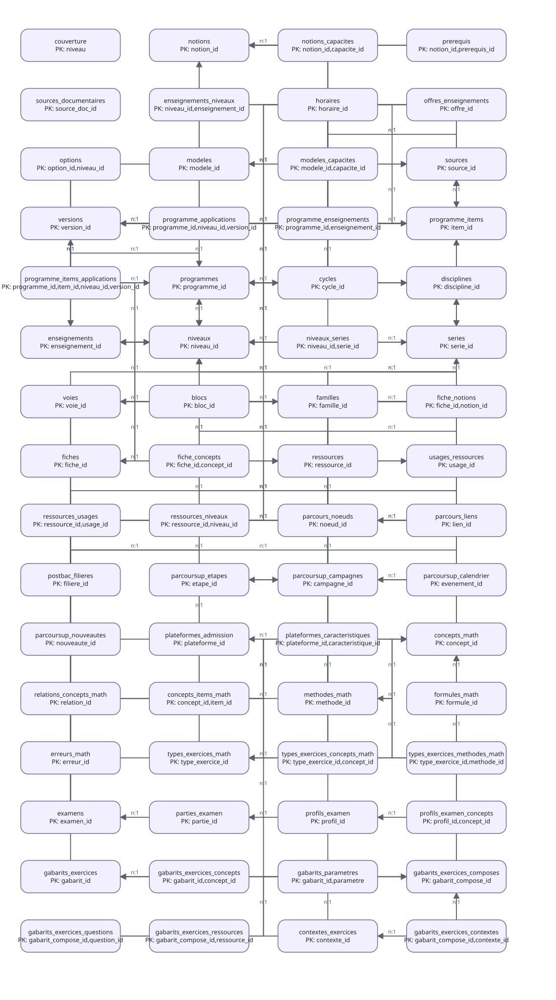
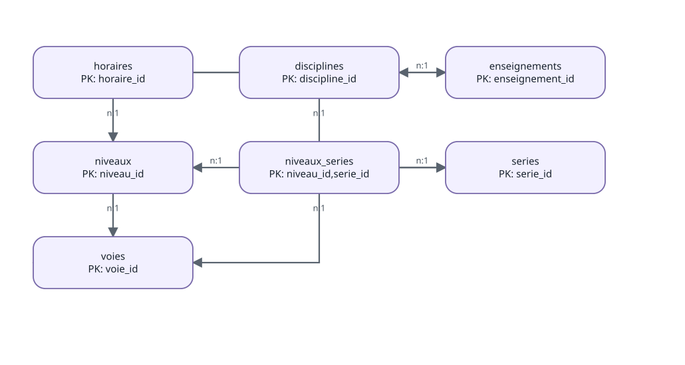

# Rentrer en profondeur dans eduschool

``` r

library(eduschool)
```

`eduschool` est volontairement un **mini système d’information
relationnel**. Il ne cherche pas à remplacer les textes officiels ni à
maintenir une base de données complexe. Son objectif est plus simple :
conserver des données scolaires lisibles dans des fichiers CSV, déclarer
clairement leurs relations, contrôler leur cohérence et fournir des
fonctions R stables pour les interroger.

Cette vignette décrit le fonctionnement interne du package. Les
inventaires, contrôles et diagrammes ci-dessous sont produits à partir
des données et des métadonnées réellement installées avec `eduschool`.

## 1. Le principe : des CSV simples, un modèle explicite

Les données sont rangées par domaine sous `inst/` : référentiels,
enseignements, programmes, documentation, exercices et révisions. Elles
restent donc lisibles avec les outils les plus simples possibles :

``` r

read.csv2(
  eduschool_path("referentiels", "niveaux.csv"),
  stringsAsFactors = FALSE
)
```

Les fonctions publiques
([`niveaux()`](https://gilles13.github.io/eduschool/reference/niveaux.md),
[`horaires_niveau()`](https://gilles13.github.io/eduschool/reference/horaires_niveau.md),
[`programmes()`](https://gilles13.github.io/eduschool/reference/programmes.md),
etc.) constituent toutefois l’interface recommandée. Elles évitent de
dupliquer les règles de jointure et de filtrage dans les analyses et
dans les vignettes.

## 2. Un contrat de données lui-même stocké en CSV

Trois fichiers décrivent le mini-SI :

- `inst/metadata/tables.csv` : catalogue des tables, fichiers et clés
  primaires ;
- `inst/metadata/colonnes.csv` : colonnes attendues, type de stockage,
  type sémantique et rôle PK/FK ;
- `inst/metadata/relations.csv` : clés étrangères et cardinalités.

Ils sont directement consultables :

``` r

head(tables_si())
#>                   table                                 fichier       domaine
#> 1            couverture            documentation/couverture.csv documentation
#> 2               notions               documentation/notions.csv documentation
#> 3     notions_capacites     documentation/notions_capacites.csv documentation
#> 4             prerequis             documentation/prerequis.csv documentation
#> 5 sources_documentaires documentation/sources_documentaires.csv documentation
#> 6 enseignements_niveaux enseignements/enseignements_niveaux.csv enseignements
#>                            description              cle_primaire
#> 1   Couverture documentaire par niveau                    niveau
#> 2     Notions pedagogiques documentees                 notion_id
#> 3 Relations entre notions et capacites     notion_id,capacite_id
#> 4              Prerequis entre notions    notion_id,prerequis_id
#> 5   Sources documentaires pedagogiques             source_doc_id
#> 6 Enseignements disponibles par niveau niveau_id,enseignement_id
#>                                                             colonnes
#> 1 niveau,themes,capacites,capacites_documentees,couverture_capacites
#> 2               notion_id,discipline_id,libelle,description,document
#> 3                                         notion_id,capacite_id,role
#> 4                      notion_id,prerequis_id,importance,commentaire
#> 5                              source_doc_id,libelle,url,type_source
#> 6                                   niveau_id,enseignement_id,statut
head(colonnes_si())
#>        table               colonne type_stockage type_semantique role nullable
#> 1 couverture                niveau     character            text   PK      non
#> 2 couverture                themes     character         integer           oui
#> 3 couverture             capacites     character         integer           oui
#> 4 couverture capacites_documentees     character         integer           oui
#> 5 couverture  couverture_capacites     character         decimal           oui
#> 6    notions             notion_id     character      identifier   PK      non
#>                                   description
#> 1                                            
#> 2                                            
#> 3                                            
#> 4                                            
#> 5                                            
#> 6 Identifiant stable d’une notion pédagogique
head(relations_si())
#>   relation_id   table_source colonne_source table_cible colonne_cible nullable
#> 1      REL001        niveaux       cycle_id      cycles      cycle_id      oui
#> 2      REL002        niveaux        voie_id       voies       voie_id      oui
#> 3      REL003          voies voie_parent_id       voies       voie_id      oui
#> 4      REL004         series        voie_id       voies       voie_id      non
#> 5      REL005 niveaux_series      niveau_id     niveaux     niveau_id      non
#> 6      REL006 niveaux_series       serie_id      series      serie_id      non
#>   cardinalite          description
#> 1         n:1      Cycle du niveau
#> 2         n:1       Voie du niveau
#> 3         n:1 Hierarchie des voies
#> 4         n:1     Voie de la serie
#> 5         n:1   Niveau de la serie
#> 6         n:1     Serie disponible
```

Cette approche garde une propriété importante du projet : **les
métadonnées sont aussi simples que les données**. Aucun format ou moteur
supplémentaire n’est nécessaire pour comprendre le modèle.

## 3. Inventaire réel des tables

L’inventaire suivant n’est pas écrit à la main.
[`inventaire_si()`](https://gilles13.github.io/eduschool/reference/inventaire_si.md)
lit le catalogue puis chaque CSV pour calculer sa taille réelle.

``` r

inv = inventaire_si()
knitr::kable(
  inv[, c("table", "domaine", "cle_primaire", "n_lignes", "n_colonnes")],
  row.names = FALSE
)
```

| table | domaine | cle_primaire | n_lignes | n_colonnes |
|:---|:---|:---|---:|---:|
| couverture | documentation | niveau | 11 | 5 |
| notions | documentation | notion_id | 253 | 5 |
| notions_capacites | documentation | notion_id,capacite_id | 487 | 3 |
| prerequis | documentation | notion_id,prerequis_id | 33 | 4 |
| sources_documentaires | documentation | source_doc_id | 2 | 4 |
| enseignements_niveaux | enseignements | niveau_id,enseignement_id | 41 | 3 |
| horaires | enseignements | horaire_id | 247 | 10 |
| offres_enseignements | enseignements | offre_id | 175 | 6 |
| options | enseignements | option_id,niveau_id | 13 | 7 |
| modeles | exercices | modele_id | 5 | 7 |
| modeles_capacites | exercices | modele_id,capacite_id | 9 | 2 |
| sources | metadata | source_id | 36 | 8 |
| versions | metadata | version_id | 4 | 4 |
| programme_applications | programmes | programme_id,niveau_id,version_id | 135 | 5 |
| programme_enseignements | programmes | programme_id,enseignement_id | 44 | 2 |
| programme_items | programmes | item_id | 1030 | 9 |
| programme_items_applications | programmes | programme_id,item_id,niveau_id,version_id | 1136 | 4 |
| programmes | programmes | programme_id | 63 | 6 |
| cycles | referentiels | cycle_id | 3 | 3 |
| disciplines | referentiels | discipline_id | 22 | 2 |
| enseignements | referentiels | enseignement_id | 56 | 4 |
| niveaux | referentiels | niveau_id | 9 | 5 |
| niveaux_series | referentiels | niveau_id,serie_id | 19 | 2 |
| series | referentiels | serie_id | 9 | 3 |
| voies | referentiels | voie_id | 4 | 3 |
| blocs | revision | bloc_id | 52 | 8 |
| familles | revision | famille_id | 7 | 3 |
| fiche_notions | revision | fiche_id,notion_id | 23 | 3 |
| fiches | revision | fiche_id | 9 | 7 |
| ressources | ressources | ressource_id | 8 | 10 |
| usages_ressources | ressources | usage_id | 7 | 4 |
| ressources_usages | ressources | ressource_id,usage_id | 24 | 2 |
| ressources_niveaux | ressources | ressource_id,niveau_id | 60 | 2 |
| parcours_noeuds | orientation | noeud_id | 10 | 8 |
| parcours_liens | orientation | lien_id | 11 | 5 |
| postbac_filieres | orientation | filiere_id | 9 | 9 |
| parcoursup_etapes | orientation | etape_id | 6 | 5 |
| parcoursup_campagnes | orientation | campagne_id | 1 | 5 |
| parcoursup_calendrier | orientation | evenement_id | 8 | 8 |
| parcoursup_nouveautes | orientation | nouveaute_id | 2 | 6 |
| plateformes_admission | orientation | plateforme_id | 2 | 7 |
| plateformes_caracteristiques | orientation | plateforme_id,caracteristique_id | 6 | 6 |
| concepts_math | mathematiques | concept_id | 178 | 7 |
| relations_concepts_math | mathematiques | relation_id | 120 | 6 |
| concepts_items_math | mathematiques | concept_id,item_id | 379 | 3 |
| methodes_math | mathematiques | methode_id | 120 | 6 |
| formules_math | mathematiques | formule_id | 71 | 6 |
| erreurs_math | mathematiques | erreur_id | 74 | 6 |
| types_exercices_math | mathematiques | type_exercice_id | 90 | 7 |
| types_exercices_concepts_math | mathematiques | type_exercice_id,concept_id | 254 | 3 |
| types_exercices_methodes_math | mathematiques | type_exercice_id,methode_id | 109 | 3 |

Une nouvelle table ajoutée au contrat apparaîtra donc automatiquement
dans cette vignette lors de sa reconstruction.

## 4. Relations entre les tables

Le diagramme suivant est généré depuis `tables.csv` et `relations.csv`.



Pour comprendre le modèle, il est souvent plus utile de regarder un
sous-ensemble. Par exemple, le rattachement des horaires aux niveaux et
aux séries :



## 5. Exemple important : seconde générale et STHR

Une ligne horaire n’est pas définie uniquement par `niveau_id`. Elle
possède aussi une **portée**. Trois cas sont distingués :

- `COMMUN` : horaire commun à tout le niveau ;
- `COMPLEMENT_SERIE` : enseignement qui complète une grille commune, par
  exemple une spécialité de la voie générale ;
- `GRILLE_SERIE` : horaire appartenant à la grille propre d’une série.

Cette distinction évite une erreur classique. Une recherche brute sur
`niveau_id == "2GT"` trouve à la fois les mathématiques de la seconde
générale et technologique commune (4 h) et celles de la seconde STHR (3
h). Ces deux lignes sont relationnellement rattachées à `2GT`, mais
elles n’ont pas la même portée.

L’API métier porte donc cette règle :

``` r

horaires_niveau("2GT")[
  horaires_niveau("2GT")$discipline_id == "MAT",
  c("enseignement_id", "volume", "portee")
]
#>   enseignement_id volume portee
#> 5        MATH_2GT      4 COMMUN

horaires_niveau("2GT", serie_id = "STHR")[
  horaires_niveau("2GT", serie_id = "STHR")$discipline_id == "MAT",
  c("enseignement_id", "volume", "serie_id", "portee")
]
#>   enseignement_id volume serie_id       portee
#> 1        MATH_2GT      3     STHR GRILLE_SERIE
```

Le point essentiel est qu’une relation valide sur le plan technique ne
suffit pas toujours : **la sémantique de la relation doit également être
modélisée**.

## 6. Pourquoi les CSV sont lus comme du texte

Les CSV constituent la couche source. Pour rendre leur lecture
déterministe, `eduschool` les charge comme des colonnes de type
`character`. Les conversions numériques ou temporelles sont ensuite
faites explicitement lorsqu’une fonction métier en a besoin.

Par exemple, `volume` conserve la représentation présente dans la source
:

``` r

h = horaires_niveau("2GT")
str(h$volume)
#>  chr [1:10] "4" "3" "5.5" "1.5" "4" "3" "1.5" "2" "18" "1.5"
```

Une fonction qui doit calculer avec cet horaire effectue explicitement
la conversion. Cela évite qu’un changement de contenu dans un CSV
modifie silencieusement le type d’une colonne à l’import.

Le fichier `colonnes.csv` distingue pour cette raison `type_stockage` et
`type_semantique` : une valeur peut être stockée comme texte tout en
représentant sémantiquement un nombre décimal, une date, une URL ou un
identifiant.

## 7. Contrôles d’intégrité : structure et sémantique

Une clé étrangère valide prouve qu’un identifiant existe. Elle ne prouve
pas que son emploi est correct dans le contexte métier. `eduschool`
distingue donc deux étages de contrôle.

### 7.1 Intégrité structurelle

Les contrôles structurels sont directement dérivés des métadonnées :

- présence des colonnes déclarées ;
- unicité et non-vacuité des clés primaires ;
- absence de clés étrangères orphelines ;
- respect des domaines structurants déclarés.

``` r

resume_controles_si(niveau = "structure")
#>            type controles_total controles_ok
#> 1 cle_etrangere              88           88
#> 2  cle_primaire              51           51
#> 3      colonnes              51           51
#> 4       domaine               1            1
```

### 7.2 Cohérence métier

Les contrôles sémantiques vérifient les règles qui ne peuvent pas être
exprimées par une simple relation PK/FK :

- une série doit appartenir à la voie de son niveau, directement ou par
  la hiérarchie des voies ;
- `COMMUN` ne doit pas porter de série, tandis que `GRILLE_SERIE` et
  `COMPLEMENT_SERIE` doivent en porter une ;
- toute série utilisée dans `horaires` doit être rattachée au niveau
  concerné ;
- une même ligne métier d’une grille horaire ne doit pas être déclarée
  deux fois ;
- l’application d’un programme doit respecter son niveau ou son cycle
  lorsqu’ils sont explicitement définis ;
- la période d’application d’un programme doit chevaucher la version
  scolaire à laquelle elle est rattachée ;
- un programme ne peut pas commencer à s’appliquer avant sa publication.

``` r

controles_semantiques = controle_integrite_si(niveau = "semantique")
knitr::kable(controles_semantiques, row.names = FALSE)
```

| type | table | objet | ok | n_anomalies | detail |
|:---|:---|:---|:---|---:|:---|
| semantique_niveau_serie | niveaux_series | voie_compatible | TRUE | 0 | / |
| semantique_horaires | horaires | portee_serie | TRUE | 0 |  |
| semantique_horaires | horaires | serie_rattachee_au_niveau | TRUE | 0 |  |
| semantique_horaires | horaires | unicite_grille | TRUE | 0 |  |
| semantique_programmes | programme_applications | niveau_cycle | TRUE | 0 | / |
| semantique_versions | programme_applications | chevauchement_version | TRUE | 0 | // |
| semantique_programmes | programme_applications | publication_avant_application | TRUE | 0 | / |

Le contrôle complet réunit les deux niveaux :

``` r

resume_controles_si()
#>                      type controles_total controles_ok
#> 1           cle_etrangere              88           88
#> 2            cle_primaire              51           51
#> 3                colonnes              51           51
#> 4                 domaine               1            1
#> 5     semantique_horaires               3            3
#> 6 semantique_niveau_serie               1            1
#> 7   semantique_programmes               2            2
#> 8     semantique_versions               1            1
```

Pour un contrôle bloquant, utile dans les tests ou avant une publication
:

``` r

controle_integrite_si(niveau = "complet", strict = TRUE)
```

Cette séparation est importante. L’anomalie historique 2GT/STHR aurait
pu passer un contrôle purement relationnel : les identifiants existaient
tous. C’est la combinaison `niveau_id + serie_id + portee` qui devait
aussi être cohérente.

## 8. De la relation brute à l’API métier

Le rôle des fonctions publiques est de concentrer les règles métier. Une
vignette ou un rapport ne devrait pas reconstruire lui-même une jointure
complexe entre `horaires`, `niveaux`, `series` et `enseignements`.

Le flux recommandé est donc :

    CSV bruts
       |
       v
    contrat de donnees (tables / colonnes / relations)
       |
       v
    controles d'integrite
       |
       v
    fonctions metier R
       |
       v
    vignettes / rapports / fiches pedagogiques

Cette séparation permet de corriger une règle une seule fois dans le
package et d’en faire bénéficier tous les usages.

## 9. Ajouter une nouvelle table sans fragiliser le SI

Pour étendre `eduschool`, la démarche recommandée est volontairement
courte :

1.  ajouter le CSV dans le domaine adapté sous `inst/` ;
2.  déclarer la table et sa clé primaire dans `tables.csv` ;
3.  déclarer ses colonnes dans `colonnes.csv` ;
4.  déclarer ses clés étrangères dans `relations.csv` ;
5.  lancer `controle_integrite_si(strict = TRUE)` ;
6.  ajouter une fonction métier lorsque l’accès direct au CSV ne suffit
    plus ;
7.  ajouter des tests sémantiques pour les règles qui ne peuvent pas
    être exprimées par une simple clé étrangère.

Le but n’est pas de multiplier les abstractions, mais de rendre
**explicites et testables** les règles qui existaient auparavant
implicitement dans le code.

## 10. Ce que DuckDB apporte, et ce qu’il ne remplace pas

DuckDB reste très utile pour explorer librement le SI et effectuer des
jointures SQL. Il n’est cependant pas la source de vérité du modèle. Les
CSV et leurs métadonnées restent la représentation portable du projet ;
DuckDB est un moteur d’interrogation construit au-dessus d’eux.

Cette organisation permet à `eduschool` de rester un projet léger tout
en bénéficiant des garanties essentielles d’un système relationnel :
identifiants stables, relations déclarées, contrôles reproductibles et
API métier cohérente.
