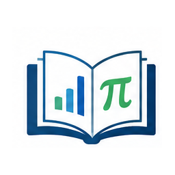

# Comprendre sa scolarité. Travailler les mathématiques.

**eduschool** cartographie la scolarité des collégiens et lycéens en
France et propose des outils simples pour réviser, s’entraîner et
progresser en mathématiques.

**[Explorer un parcours
→](https://gilles13.github.io/eduschool/articles/parcours-scolaires.md)**
· **[Réviser les maths
→](https://gilles13.github.io/eduschool/articles/fiches-revision-mathematiques.md)**

De la 6e à la Terminale · données structurées · outils R · projet open
source et collaboratif.

------------------------------------------------------------------------

## Aller directement à sa classe

**Collège :**
[6e](https://gilles13.github.io/eduschool/articles/mathematiques-6e.md)
·
[5e](https://gilles13.github.io/eduschool/articles/mathematiques-5e.md)
·
[4e](https://gilles13.github.io/eduschool/articles/mathematiques-4e.md)
·
[3e](https://gilles13.github.io/eduschool/articles/mathematiques-3e.md)

**Lycée :**
[2de](https://gilles13.github.io/eduschool/articles/mathematiques-2de.md)
· [1re
spécialité](https://gilles13.github.io/eduschool/articles/mathematiques-1re-specialite.md)
· [Terminale
spécialité](https://gilles13.github.io/eduschool/articles/mathematiques-terminale-specialite.md)

[Voir toutes les fiches et ressources de mathématiques
→](https://gilles13.github.io/eduschool/articles/mathematiques-par-niveau.md)

------------------------------------------------------------------------

## Les quatre portes d’entrée


### [Parcours scolaire](https://gilles13.github.io/eduschool/articles/parcours-scolaires.md)

Niveaux, cycles, voies, séries, options, spécialités, orientation et
Parcoursup.



### [Mathématiques](https://gilles13.github.io/eduschool/articles/fiches-revision-mathematiques.md)

Programmes, capacités, fiches de révision, exercices et ressources.


### [Créer et partager](https://gilles13.github.io/eduschool/articles/contribuer-et-partager.md)

Adapter les outils, proposer des corrections et mutualiser fiches et
exercices.


### [Données et R](https://gilles13.github.io/eduschool/reference/index.md)

Une API simple pour explorer les données, produire des documents et
aller plus loin.

------------------------------------------------------------------------

## Commencer avec quelques verbes

L’API principale privilégie des verbes courts et faciles à lire :

``` r

library(eduschool)

parcours("3E")
orientation("2GT")
programme("6E")
revision("6E")
exercices("6E", n = 5)
```

Les fonctions détaillées restent disponibles. Cette façade simplifie
l’entrée dans `eduschool` sans masquer le système relationnel
sous-jacent.

------------------------------------------------------------------------

## Pour qui ?

| Élèves | Parents | Utilisateurs R et enseignants |
|:---|:---|:---|
| Réviser, s’entraîner et comprendre son parcours. | Suivre la scolarité et comprendre les choix d’orientation. | Interroger les référentiels, produire et adapter des supports. |

------------------------------------------------------------------------

## Créer, adapter, partager


Partager les connaissances

`eduschool` est un projet open source. Son architecture doit permettre
de construire progressivement ses propres fiches et exercices avec les
mêmes briques que celles utilisées par le package.

**Utiliser → créer → adapter → partager**

Les corrections de données, ressources, fiches, exercices,
visualisations et améliorations de l’API ont vocation à être
mutualisées.

**[Voir comment contribuer
→](https://gilles13.github.io/eduschool/articles/contribuer-et-partager.md)**

------------------------------------------------------------------------

## Un projet volontairement centré sur les math


L’architecture d’`eduschool` peut accueillir d’autres disciplines. Les
fiches de révision et les exercices restent volontairement consacrés aux
mathématiques. Cette limite permet de garder un outil cohérent,
maintenable et réellement utile.
