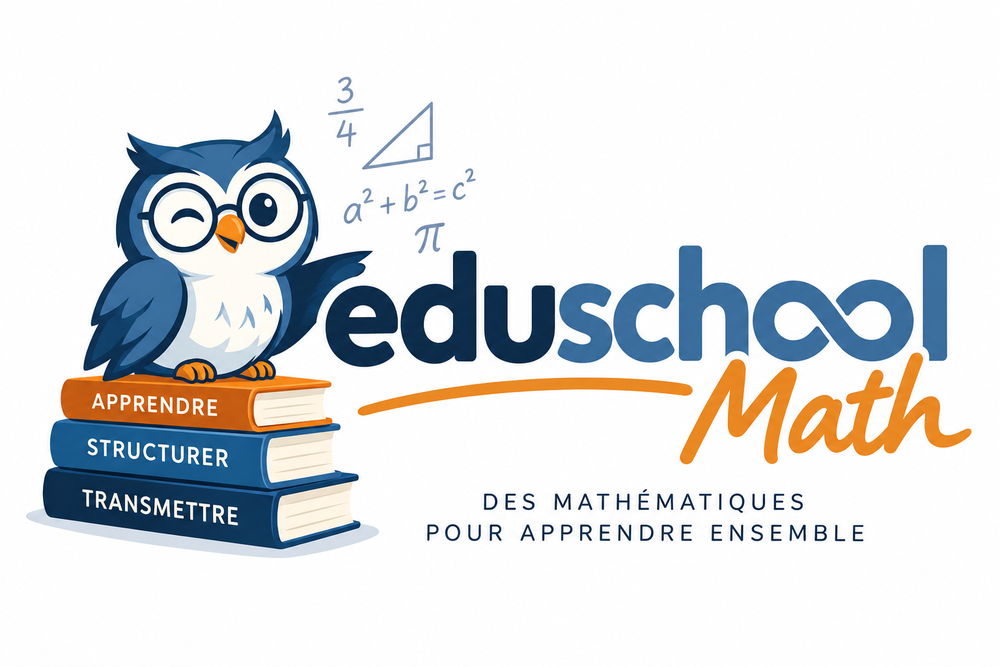

# eduschool



`eduschool` est un package R en cours de développement pour consulter
des référentiels scolaires français, relier programmes, capacités et
notions pédagogiques, produire des exercices de révision reproductibles
et visualiser l’organisation des parcours et des données.

## Installation depuis RStudio

Le plus simple est d’installer `eduschool` directement depuis GitHub.

Dans la console RStudio, installer d’abord `remotes` si nécessaire :

``` r

install.packages("remotes")
```

Puis installer `eduschool` :

``` r

remotes::install_github("gilles13/eduschool")
library(eduschool)
```

`remotes` ne doit être installé qu’une seule fois. Pour mettre ensuite
`eduschool` à jour, il suffit de relancer :

``` r

remotes::install_github("gilles13/eduschool")
```

Il n’est donc pas nécessaire de télécharger manuellement le dépôt GitHub
ni de manipuler un fichier ZIP.

## Premier usage

``` r

library(eduschool)

# Les niveaux disponibles
niveaux()

# Capacités mathématiques de 6e
x = capacites("6E")
head(x)

# Documentation pédagogique
chercher_notions("fraction")
notions_capacite("ITM_MAT_C3_6E_C09")
cat(obtenir_rappel("MAT_FRACTION_ADD"))

# Générer des exercices
fiche = generer_fiche(
  niveau_id = "6E",
  capacite_id = "ITM_MAT_C3_6E_C09",
  n = 5,
  difficulte = 1,
  seed = 2026
)
```

## Ce que permet le package

`eduschool` rassemble plusieurs briques complémentaires :

- des référentiels structurés sur les niveaux, disciplines, programmes
  et capacités ;
- des fiches pédagogiques reliées aux notions ;
- des modèles permettant de générer des exercices et des fiches de
  révision ;
- une couche relationnelle optionnelle avec DuckDB pour les
  consultations plus complexes ;
- des diagrammes HTML et SVG pour représenter les parcours scolaires et
  l’architecture du système ;
- des vignettes et un site `pkgdown` pour documenter l’utilisation du
  package.

## Documentation

Pour découvrir le *package*, commencer par la vignette `prise-en-main`.

Les autres vignettes présentent notamment les parcours scolaires, les
programmes et capacités, la documentation pédagogique, la génération
d’exercices, l’architecture des données et le fonctionnement interne du
package.

Depuis RStudio, les vignettes installées peuvent être consultées avec :

``` r

browseVignettes("eduschool")
```

Le site pkgdown constitue également la documentation utilisateur publiée
du *package*.

Le dossier `documentation/` contient les documents techniques destinés
au développement et à la maintenance du projet.
