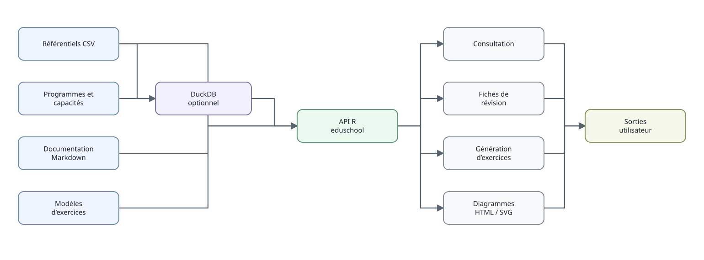

```{r, include=FALSE}
knitr::opts_chunk$set(collapse = TRUE, comment = "#>")
```



`eduschool` est volontairement un petit système d'information relationnel, pas
une base monolithique. Les ressources distribuées sont conservées sous `inst/`
et retrouvées avec `eduschool_path()`.

## Couches principales

Le flux logique est : programme officiel → capacité → notion → prérequis → rappel
→ modèle d'exercice → exercice → document. Cette séparation permet notamment :

- de conserver les sources réglementaires distinctes des contenus pédagogiques ;
- de réutiliser une notion dans plusieurs programmes ;
- d'enrichir les rappels et les exercices sans recopier les programmes ;
- de produire des vues synthétiques par niveau sans en faire une nouvelle source
  de vérité.

## CSV d'abord, DuckDB ensuite

Les consultations simples utilisent directement les CSV :

```{r, eval=FALSE}
niveaux()
enseignements()
themes_niveau("2GT")
```

DuckDB reste disponible pour les jointures et analyses relationnelles libres :

```{r, eval=FALSE}
con = ouvrir_base()
DBI::dbListTables(con)
DBI::dbDisconnect(con)
```

Cette architecture garde les fichiers sources lisibles indépendamment de R et
du moteur de base de données.
