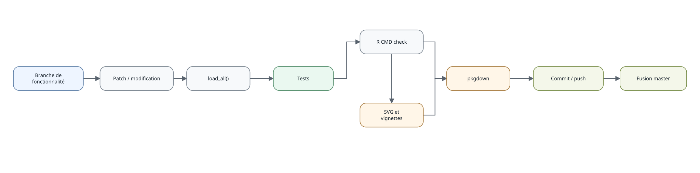
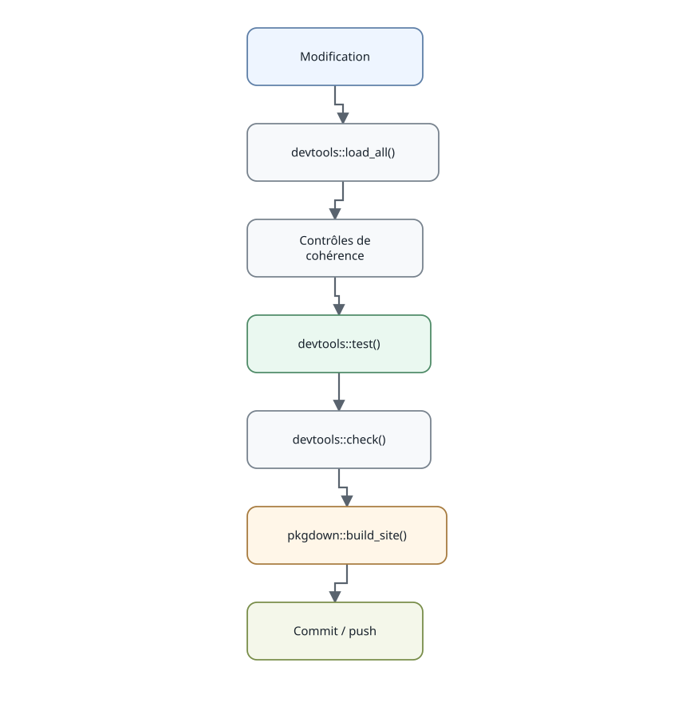

```{r, include=FALSE}
knitr::opts_chunk$set(collapse = TRUE, comment = "#>")
```

Le développement de `eduschool` suit une chaîne courte : chargement du code, tests, contrôle du package, régénération éventuelle des visuels puis construction du site pkgdown.



Les contrôles détaillés du package sont résumés ci-dessous.



Les SVG sont pré-générés et versionnés. Ils peuvent être reconstruits directement en R après modification des modèles graphiques avec :

```{r, eval=FALSE}
generer_documentation_visuelle()
```

La génération est native et ne dépend ni de Mermaid, ni de Node.js, ni de npm. Les mêmes graphes internes servent aux sorties SVG et HTML.
