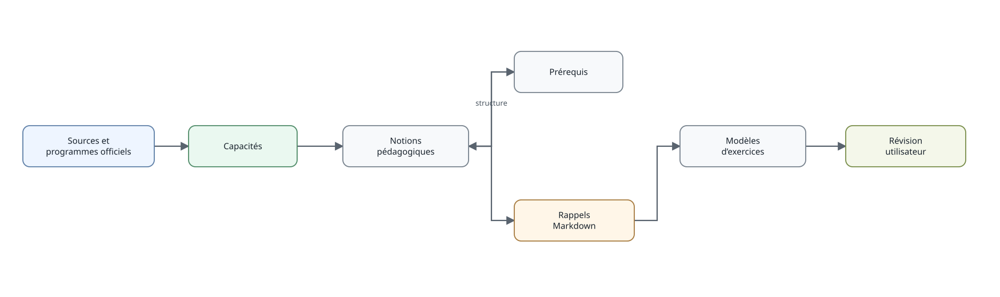

```{r, include=FALSE}
knitr::opts_chunk$set(collapse = TRUE, comment = "#>")
```



La documentation est séparée des programmes officiels. Une notion pédagogique peut être reliée à plusieurs capacités.

```{r, eval=FALSE}
chercher_notions("proportion")
notions_capacite("ITM_MAT_C3_6E_C31")
prerequis_capacite("ITM_MAT_C3_6E_C31", recursif = TRUE)
```

Les rappels sont des fichiers Markdown installés avec le package et accessibles par `obtenir_rappel()`. Cette séparation permettra ultérieurement une personnalisation sans modifier les référentiels officiels.
