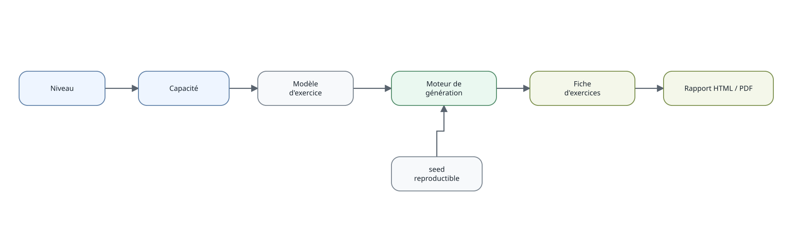

```{r, include=FALSE}
knitr::opts_chunk$set(collapse = TRUE, comment = "#>")
```



Le moteur d'exercices est déterministe lorsqu'un `seed` est fourni. Pour voir
immédiatement les énoncés dans la console :

```{r, eval=FALSE}
generer_fiche(
  "6E",
  "ITM_MAT_C3_6E_C09",
  n = 5,
  seed = 123,
  afficher = TRUE
)
```

## Produire une fiche HTML ou PDF

La sortie de `generer_fiche()` peut être envoyée directement vers un document :

```{r, eval=FALSE}
generer_fiche(
  "6E",
  "ITM_MAT_C3_6E_C09",
  n = 10,
  seed = 123
) |>
  produire_fiche(format = "auto")
```

Le nom est construit automatiquement à partir du niveau et de la capacité. Pour
une fiche multi-capacités, le suffixe `mixte` est utilisé. L'argument `fichier`
permet toujours de choisir soi-même le chemin de sortie.

`format = "auto"` choisit le PDF si `pdflatex` est disponible sur la machine et
le HTML sinon. Pour imposer un format :

```{r, eval=FALSE}
generer_fiche("6E", "ITM_MAT_C3_6E_C09", n = 10, seed = 123) |>
  produire_fiche(format = "html")

generer_fiche("6E", "ITM_MAT_C3_6E_C09", n = 10, seed = 123) |>
  produire_fiche(format = "pdf")
```

La sortie HTML ne nécessite pas LaTeX. Les deux formats reposent sur le rendu
R Markdown/Pandoc ; la sortie PDF nécessite en plus une installation LaTeX
fournissant `pdflatex`.

## Produire le corrigé

Le même lot d'exercices peut être envoyé au template de corrigé :

```{r, eval=FALSE}
generer_fiche("6E", "ITM_MAT_C3_6E_C09", n = 10, seed = 123) |>
  produire_corrige(format = "auto")
```

Les anciennes fonctions de rapport LaTeX restent disponibles pour compatibilité,
mais `produire_fiche()` et `produire_corrige()` constituent l'interface conseillée
pour les nouveaux usages.

## Fiches de révision mathématiques

À partir de la version 0.11.0, les révisions constituent un moteur distinct des
exercices. Les fiches sont structurées en familles et reliées aux notions déjà
présentes dans la base documentaire.

La seconde générale et technologique sert de niveau pilote :

```{r, eval=FALSE}
fiches_revision("2GT")
```

Une fiche thématique peut être construite puis envoyée directement vers le
rendu HTML ou PDF :

```{r, eval=FALSE}
generer_revision("2GT", "GEOMETRIE") |>
  produire_revision(format = "auto")
```

Les familles disponibles en seconde couvrent notamment nombres et algèbre,
géométrie, fonctions, statistiques-probabilités, algorithmique, logique et
automatismes.

Pour les révisions de dernière minute, une fiche beaucoup plus dense conserve
uniquement les formules, méthodes et points de vigilance essentiels :

```{r, eval=FALSE}
generer_essentiel("2GT") |>
  produire_revision(format = "auto")
```

Le contenu des fiches est stocké dans `inst/revision/`. Les relations avec les
notions existantes sont séparées du contenu éditorial, de sorte qu'une fiche de
révision reste une vue synthétique du système d'information et ne constitue pas
une nouvelle source de vérité.


## Composer un examen de mathématiques

Les examens constituent une troisième chaîne de production, distincte des fiches
d’exercices et des fiches de révision. Pour le DNB, le flux est :

```{r, eval=FALSE}
sujet = composer_examen("DNB", 2026, seed = 123)
partie1 = rediger_examen(sujet, partie = 1)
produire_examen(partie1)
produire_corrige_examen(partie1)
```

Les figures et blocs Scratch ne sont pas des images stockées dans la banque. Ils
sont décrits comme des ressources structurées puis dessinés par R au moment du
rendu. La vignette **Composer et produire un DNB de mathématiques** détaille ce
fonctionnement et la façon d’enrichir la banque avec les nouvelles sessions.
