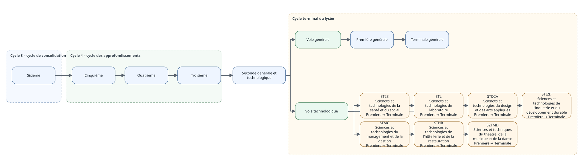

```{r, include=FALSE}
knitr::opts_chunk$set(collapse = TRUE, comment = "#>")
```

Cette vignette présente les parcours scolaires actuellement modélisés dans `eduschool`. Le schéma est construit à partir des référentiels du package et sera enrichi à mesure que les voies, séries et orientations seront détaillées.



Le diagramme HTML interactif correspondant peut être produit avec :

```{r, eval=FALSE}
diagramme_parcours_scolaire(ouvrir = TRUE)
```

La représentation graphique n'est pas une source de vérité indépendante : elle est une vue des données relationnelles du package.
