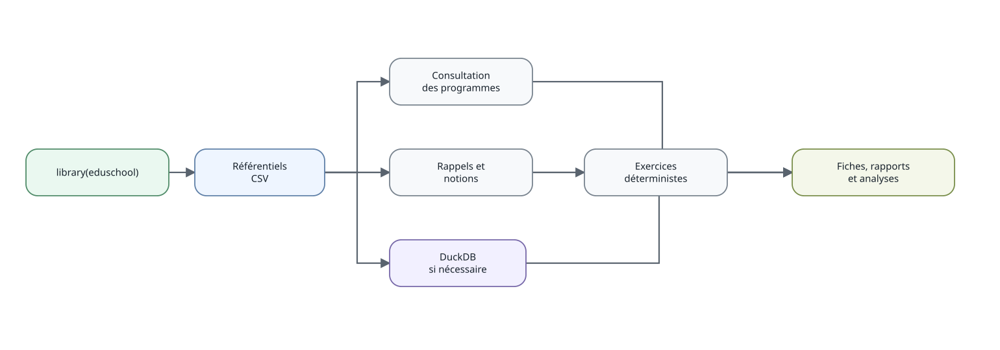

```{r, include=FALSE}
knitr::opts_chunk$set(collapse = TRUE, comment = "#>")
```



# Objectif

Cette vignette présente le chemin le plus court pour utiliser le package. Les
articles consacrés à la 6e et à la 2de montrent ensuite des usages plus complets.

```{r, eval=FALSE}
library(eduschool)
niveaux()
genere_resume("6E")
genere_resume("2GT", matiere = "maths")
```

## Passer du programme à une notion

```{r, eval=FALSE}
capacites("6E", discipline_id = "MAT", version_id = "2026_2027")
notions_capacite("ITM_MAT_C3_6E_C09")
cat(obtenir_rappel("MAT_FRACTION_ADD"))
```

Les fonctions `themes_niveau()`, `notions_niveau()` et `resume_niveau()` donnent
accès aux tables plus détaillées lorsque la synthèse de `genere_resume()` ne
suffit plus.

## Produire une fiche de révision

```{r, eval=FALSE}
generer_fiche("6E", "ITM_MAT_C3_6E_C09", n = 5, seed = 2026) |>
  produire_fiche(format = "auto")
```

Le nom de sortie est automatique. `format = "auto"` choisit un PDF lorsque
LaTeX est disponible et un HTML sinon. Un nom explicite reste possible :

```{r, eval=FALSE}
generer_fiche("6E", "ITM_MAT_C3_6E_C09", n = 5, seed = 2026) |>
  produire_fiche(fichier = "ma_fiche", format = "html")
```


## Composer une épreuve de brevet

Le moteur d’examens suit la même logique de reproductibilité que les fiches.
Une composition est d’abord produite, puis rédigée, avant son rendu :

```{r, eval=FALSE}
sujet = composer_examen("DNB", 2026, seed = 123)
partie1 = rediger_examen(sujet, partie = 1)
produire_examen(partie1, fichier = "dnb-automatismes.pdf")
```

Le corrigé correspondant utilise exactement la même variante :

```{r, eval=FALSE}
produire_corrige_examen(partie1, fichier = "dnb-automatismes-corrige.pdf")
```

La vignette **Composer et produire un DNB de mathématiques** décrit le modèle,
la banque de gabarits et l’ajout progressif de nouvelles annales.

## DuckDB seulement si nécessaire

Les consultations usuelles lisent directement les ressources du package. La
couche DuckDB reste disponible pour les requêtes relationnelles plus libres.

```{r, eval=FALSE}
con = ouvrir_base()
DBI::dbListTables(con)
DBI::dbDisconnect(con)
```
