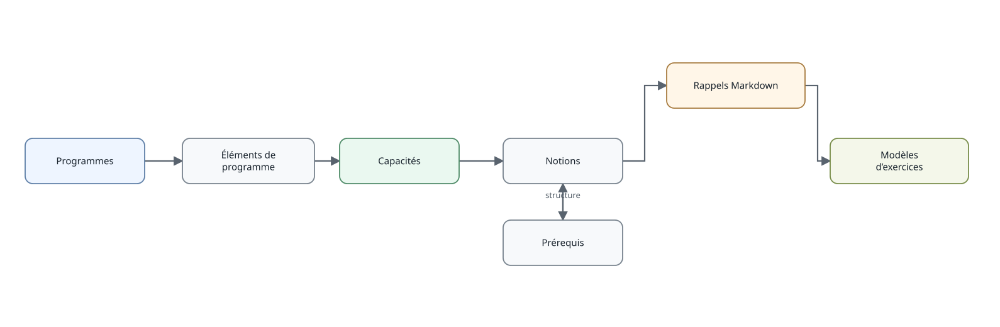

```{r, include=FALSE}
knitr::opts_chunk$set(collapse = TRUE, comment = "#>")
```



Les référentiels sont consultables sans connexion préalable. `programmes()`
filtre les programmes et `capacites()` retourne les éléments explicitement
modélisés comme capacités.

```{r, eval=FALSE}
programmes("MAT")
programmes("MAT", niveau_id = "2GT")
capacites("5E", version_id = "2026_2027")
```

## Lire un niveau dans son ensemble

Pour parcourir un niveau, les fonctions de synthèse évitent d'avoir à reconstruire
les jointures entre programmes et applications :

```{r, eval=FALSE}
horaires_niveau("2GT")
themes_niveau("2GT")
notions_niveau("2GT")
resume_niveau("2GT")
```

`genere_resume()` fournit une vue plus compacte destinée à la lecture directe :

```{r, eval=FALSE}
genere_resume("2GT")
genere_resume("2GT", matiere = "maths")
```

Les identifiants sont stables dans le projet et servent de clés dans les
relations documentaires et les modèles d'exercices. Les programmes officiels et
la documentation pédagogique restent séparés : une notion peut ainsi être
réutilisée par plusieurs capacités ou plusieurs niveaux.
